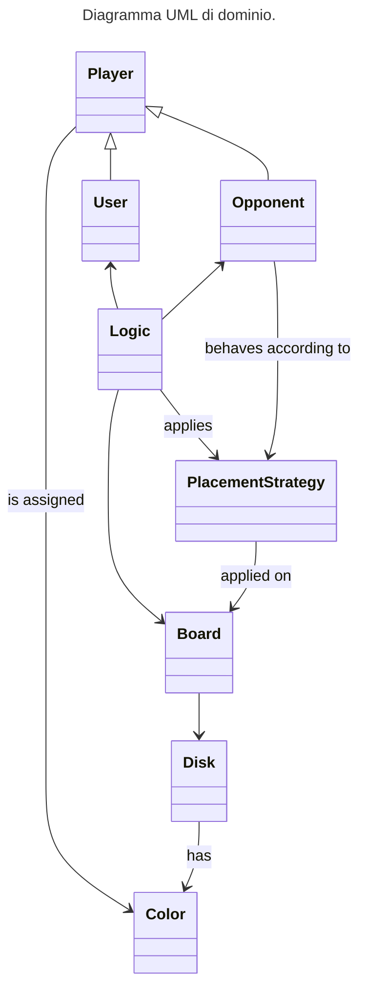

# Requisiti

In questo capitolo, sono riportati tutti i requisiti emersi in fase di analisi.

La presentazione dei requisiti si articola nelle seguenti sezioni:

- [Requisiti di business](#requisiti-di-business)
- [Modello di dominio](#modello-di-dominio)
- [Requisiti funzionali](#requisiti-funzionali)
- [Requisiti non funzionali](#requisiti-non-funzionali)
- [Requisiti di implementazione](#requisiti-di-implementazione)

## Requisiti di business

L'obiettivo centrale del progetto è la realizzazione di un'applicazione che permetta di giocare al gioco da tavolo Othello. Nello specifico, l'utente potrà giocare in modalità single-player contro un giocatore virtuale autonomo. L'implementazione del gioco dovrà aderire alle regole tradizionali di Othello (le quali sono riportate in seguito).

## Modello di dominio

Questa sezione ha l'obiettivo di presentare il dominio applicativo del progetto, ossia il gioco Othello. A tale scopo, sono innanzitutto riportate le regole tradizionali del gioco, al quale l'implementazione realizzata dovrà aderire. Successivamente, sulla base di queste e degli obiettivi esplicitati nella precedente sezione, sono individuate le entità coinvolte e le relazioni tra queste, fino a pervenire ad un modello di dominio espresso tramite il formalismo UML.

### Regole del gioco

Il gioco prevede due giocatori, ciascuno dei quali possiede un determinato numero di pedine (dette "dischi"), le quali sono di colore nero da un lato e di colore bianco dall'altro. Ad ogni giocatore è assegnato uno dei due colori. Il terreno di gioco, diviso in celle, è di forma quadrata o rettangolare.

Prima di iniziare a giocare, si posizionano due dischi bianchi e due neri nelle quattro caselle centrali del terreno di gioco, in modo da creare una configurazione a X con i dischi bianchi lungo una diagonale e con i dischi neri lungo l'altra diagonale.

Il giocatore che inizia il gioco è quello a cui è assegnato il colore nero. A turni alterni, ciascun giocatore effettua una mossa, che consiste nell'appoggiare una nuovo disco in una casella vuota in modo che esso imprigioni uno o più dischi avversari. Con il termine "imprigionare", si intende chiudere il lato opposto ancora libero di un disco o sequenza di dischi avversari. Si possono imprigionare dischi in orizzontale, in verticale e in diagonale. Un disco, una volta imprigionato, viene rovesciato e diventa di proprietà di chi ha eseguito la mossa.

Sono ammesse solo mosse con le quali si gira almeno un disco, altrimenti il giocatore salta il turno. Un giocatore non può passare il turno se ha almeno una mossa valida.

Si precisa, inoltre, che non è possibile spostare in un'altra cella un disco che è già stato posizionato sul terreno di gioco.

Una partita termina quando si presenta almeno una delle due seguenti condizioni:

- tutte le caselle di gioco sono occupate da un disco;
- nessuno dei due giocatori ha mosse valide da effettuare.

Il vincitore è il giocatore che, al termine della partita, ha il maggior numero di dischi del proprio colore sul terreno di gioco.

### Analisi del dominio

Dalle regole del gioco, si distinguono innanzitutto le seguenti entità:

- il terreno di gioco (`Board`);
- i dischi (`Disk`) posizionati sul terreno di gioco dai giocatori;
- il concetto di colore (`Color`), sia come colore corrente di un disco posizionato sul colore di gioco, sia come colore assegnato ad un avversario;
- il concetto di giocatore (`Player`).

Dato inoltre il requisito secondo cui l'utente deve poter giocare in modalità single player contro un avversario virtuale, si distinguono come giocatori l'utente umano (`User`) e l'avversario virtuale (`Opponent`). Poiché l'avversario virtuale deve essere in grado di giocare in maniera autonoma, si deduce inoltre che l'avversario debba essere dotato di una strategia da seguire per decidere quale mossa effettuare (`PlacementStrategy`).

Infine, si deduce anche la necessità di avere un'entità che rappresenti la logica di gioco (`Logic`), la quale abbia il compito di coordinare l'interazione tra le diverse entità al fine di attuare le dinamiche di gioco previste; ad esempio, tale entità si dovrà occupare della gestione dei turni, della gestione del compimento di una mossa da parte di un giocatore e della verifica delle condizioni di terminazione della partita.

Il seguente diagramma UML riassume le entità e le relazioni tra queste che sono state individuate.

## Requisiti funzionali

### Utente

### Sistema

## Requisiti non funzionali

## Requisiti di implementazione

- Realizzare l'applicazione interamente in Scala, salvo eventualmente realizzare piccole parti dell'applicazione in TuProlog qualora sia ritenuto opportuno per valide motivazioni tecniche.
