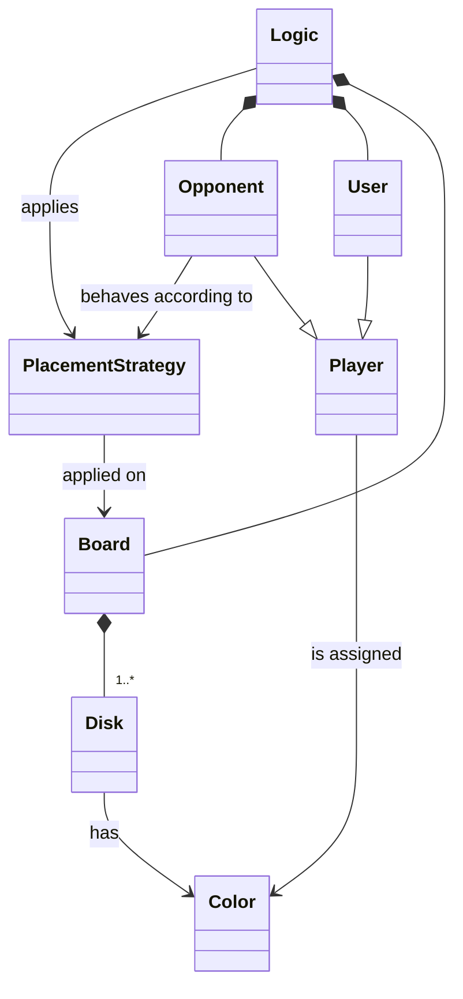

# Requisiti

In questo capitolo, sono riportati tutti i requisiti emersi in fase di analisi.

La presentazione dei requisiti si articola nelle seguenti sezioni:

- [Requisiti di business](#requisiti-di-business)
- [Modello di dominio](#modello-di-dominio)
- [Requisiti funzionali](#requisiti-funzionali)
- [Requisiti non funzionali](#requisiti-non-funzionali)
- [Requisiti di implementazione](#requisiti-di-implementazione)

## Requisiti di business

L'obiettivo centrale del progetto è la realizzazione di un'applicazione che permetta di giocare al gioco da tavolo Othello. Nello specifico, l'utente potrà giocare in modalità single-player contro un giocatore virtuale autonomo. L'implementazione del gioco dovrà aderire alle regole tradizionali di Othello (le quali sono riportate in seguito).

## Modello di dominio

Questa sezione ha l'obiettivo di presentare il dominio applicativo del progetto, ossia il gioco Othello. A tale scopo, sono innanzitutto riportate le regole tradizionali del gioco, al quale l'implementazione realizzata dovrà aderire. Successivamente, sulla base di queste e degli obiettivi esplicitati nella precedente sezione, sono individuate le entità coinvolte e le relazioni tra queste, fino a pervenire ad un modello di dominio espresso tramite il formalismo UML.

### Regole del gioco

Il gioco prevede due giocatori, ciascuno dei quali possiede un determinato numero di pedine (dette "dischi"), le quali sono di colore nero da un lato e di colore bianco dall'altro. Ad ogni giocatore è assegnato uno dei due colori. Il terreno di gioco, diviso in celle, è di forma quadrata o rettangolare.

Prima di iniziare a giocare, si posizionano due dischi bianchi e due neri nelle quattro caselle centrali del terreno di gioco, in modo da creare una configurazione a X con i dischi bianchi lungo una diagonale e con i dischi neri lungo l'altra diagonale.

Il giocatore che inizia il gioco è quello a cui è assegnato il colore nero. A turni alterni, ciascun giocatore effettua una mossa, che consiste nell'appoggiare una nuovo disco in una casella vuota in modo che esso imprigioni uno o più dischi avversari. Con il termine "imprigionare", si intende chiudere il lato opposto ancora libero di un disco o sequenza di dischi avversari. Si possono imprigionare dischi in orizzontale, in verticale e in diagonale. Un disco, una volta imprigionato, viene rovesciato e diventa di proprietà di chi ha eseguito la mossa.

Sono ammesse solo mosse con le quali si gira almeno un disco, altrimenti il giocatore salta il turno. Un giocatore non può passare il turno se ha almeno una mossa valida.

Si precisa, inoltre, che non è possibile spostare in un'altra cella un disco che è già stato posizionato sul terreno di gioco.

Una partita termina quando si presenta almeno una delle due seguenti condizioni:

- tutte le caselle del terreno di gioco sono occupate da un disco;
- nessuno dei due giocatori ha mosse valide da effettuare.

Il vincitore è il giocatore che, al termine della partita, ha il maggior numero di dischi del proprio colore sul terreno di gioco.

### Analisi del dominio

Dalle regole del gioco, si distinguono innanzitutto le seguenti entità:

- il terreno di gioco (`Board`);
- i dischi (`Disk`) posizionati sul terreno di gioco dai giocatori;
- il concetto di colore (`Color`), sia come colore corrente di un disco posizionato sul colore di gioco, sia come colore assegnato ad un giocatore;
- il concetto di giocatore (`Player`).

Dato inoltre il requisito secondo cui l'utente deve poter giocare in modalità single player contro un avversario virtuale, si distinguono come giocatori l'utente umano (`User`) e l'avversario virtuale (`Opponent`). Sia l'utente umano che l'avversario virtuale sono accomunati dal fatto di avere un colore assegnato. Inoltre, poiché l'avversario virtuale deve essere in grado di giocare in maniera autonoma, si deduce che l'avversario debba essere dotato di una strategia da seguire per decidere quale mossa effettuare (`PlacementStrategy`), la quale dovrà considerare lo stato corrente del terreno di gioco.

Infine, si deduce anche la necessità di avere un'entità che rappresenti la logica di gioco (`Logic`), la quale abbia il compito di coordinare l'interazione tra le diverse entità al fine di attuare le dinamiche di gioco previste; ad esempio, tale entità si dovrà occupare della gestione dei turni, della gestione del compimento di una mossa da parte di un giocatore e della verifica delle condizioni di terminazione della partita.

Il seguente diagramma UML riassume le entità e le relazioni tra queste che sono state individuate.

## Requisiti funzionali

### Utente

- L’utente deve poter avviare una nuova partita, in cui giocherà contro un avversario virtuale implementato dal sistema che gioca in maniera autonoma.
- All'avvio di una partita, l'utente deve poter personalizzare le seguenti proprietà.
  - Il colore assegnato a sé (nero o bianco).
  - La forma del terreno di gioco (quadrata o rettangolare) e le sue dimensioni dei suoi lati. La misura di un lato è espressa in funzione del numero di celle lungo la sua direzione ed è soggetta ai seguenti vincoli.
    - Ciascun lato deve essere di dimensione pari. Tale scelta è adottata per questioni di simmetria: a inizio partita è prevista una configurazione di dischi 2x2 al centro del terreno di gioco, che risulterebbe decentrata qualora un lato del terreno di gioco fosse di dimensione dispari.
    - Per questioni di praticità, si stabilisce che un lato debba avere una dimensione compresa tra 4 e 16 celle.
  - La strategia dell'avversario (la quale determina la difficoltà della partita). Le opzioni possibili sono le seguenti:
    - _Erratic_: l'avversario sceglie una mossa casuale tra quelle disponibili.
    - _Easy_: l'avversario stabilisce la mossa da effettuare secondo una logica predefinita ma poco complessa, che determina un livello di abilità basso.
    - _Medium_: l'avversario stabilisce la mossa da effettuare secondo una logica predefinita di media compelssità, che determina un livello di abilità intermedio.
    - _Hard_: l'avversario stabilisce la mossa da effettuare secondo una logica predefinita e avanzata, che determina un livello di abilità alto.
- Ad ogni turno, se l’utente ha a disposizione almeno una mossa valida, deve obbligatoriamente effettuarne una. Con “mossa” si intende il posizionamento di uno dei propri dischi non ancora utilizzati su una cella libera del terreno di gioco. Un mossa è valida se implica la cattura di almeno un disco dell'avversario secondo le modalità descritte nelle [regole del gioco](#regole-del-gioco). Dopo che l'utente ha compiuto una mossa valida, il turno passa all'avversario, a meno che questi sia privo di mosse valide a disposizione.
- Se, quando è il suo turno, l’utente non ha a disposizione mosse valide, è obbligato a saltare il turno senza compiere nessuna mossa.
- Durante una partita, l’utente deve poter salvare lo stato corrente della partita in maniera persistente, in modo da poter sospendere la partita corrente e poterla riprendere in seguito. L’utente deve poter effettuare salvataggi di partite diverse e conservarli in contemporanea.
- L'utente deve poter eliminare un salvataggio effettuato.
- L'utente deve poter abbandonare una partita senza salvare.
- L'utente deve poter uscire dall'applicazione in qualsiasi momento.

### Di sistema

- Per quanto concerne le mosse e la gestione dei turni, l'avversario virtuale è soggetto alle stesse regole dell'utente umano. Una mossa è valida nelle stesse condizioni in cui lo è per l'utente. Quando è il turno dell'avversario virtuale, se ha a disposizione mosse valide è obbligato a effettuarne una, mentre è obbligato a saltare il turno se non ne ha. Dopo che l'avversario virtuale compiuto una mossa valida, il turno passa all'utente, a meno che questi sia privo di mosse valide a disposizione.
- Quando è il turno dell'utente e questi ha mosse valide a disposizione, il sistema deve rendere evidenti all'utente le celle del terreno di gioco su cui può posizionare un proprio disco compiendo una mossa valida.
- Il sistema deve decretare la terminazione della partita e comunicarne l’esito all’utente appena si verifica una delle condizioni di terminazione riportate nelle [regole del gioco](#regole-del-gioco).

## Requisiti non funzionali

- L'utente deve poter utilizzare l'applicazione tramite CLI (command-line interface).
- Le mosse dell'avversario virtuale devono avvenire entro un intervallo di tempo accettabile a livello di esperienza utente, tassativamente non superiore ai 2 secondi e preferibilmente inferiore a 1 secondo.

## Requisiti di implementazione

- L'applicazione deve essere interamente realizzata in linguaggio Scala.
