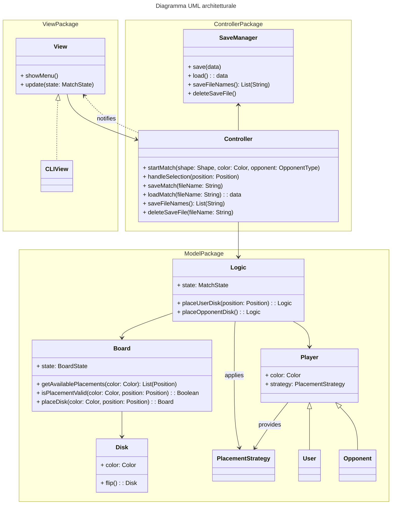
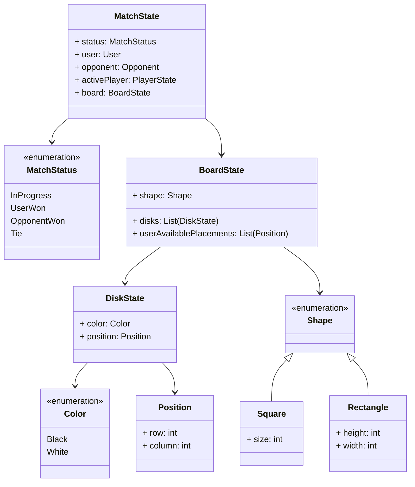
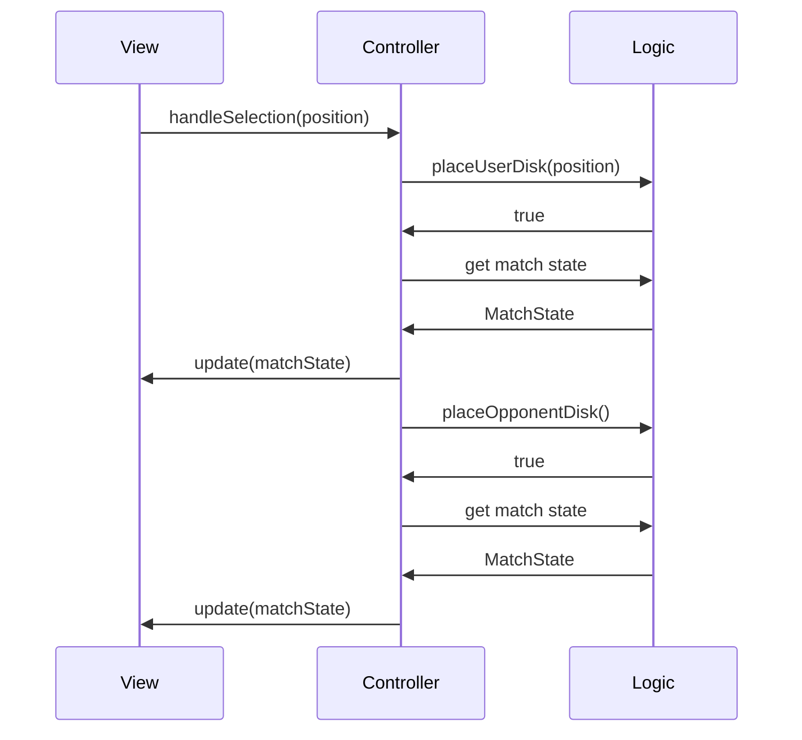

# Design architetturale

## Pattern architetturale adottato

Per l'architettura dell'applicazione, si è scelto di adottare il pattern Model-View-Controller (MVC), in quanto si concilia bene con la seguente suddivisione delle responsabilità:

- il Model incapsula l'intera logica di gioco;
- la View incapsula tutto ciò che concerne l'interfaccia utente dell'applicazione;
- il Controller comunica con la View e, nell'arco di vita di una partita, con il Model per realizzare le funzionalità previste, e si occupa anche di interagire con componenti esterne all'applicazione qualora necessario (ad esempio, con il sistema operativo per la gestione dei file di salvataggio).

La scelta architetturale adottata comporta inoltre i seguenti vantaggi.

- Poiché tutto ciò che concerne l'interfaccia utente è isolato nel modulo View, una stessa implementazione di Controller e Model può essere utilizzata da diverse implementazioni di View: ad esempio, l'interfaccia utente su Command-Line Interface (CLI) realizzata potrebbe essere sostituita da una Graphical User Interface (GUI) senza dover apportare alcuna modifica al Controller (né tantomeno al Model).
- In maniera analoga, la logica di gioco incapsulata nel Model è riutilizzabile senza alcuna modifica qualora si volessero fare modifiche anche estese a tutto ciò che esula dalle regole del gioco (ad esempio, modifiche all'interfaccia utente o, in generale, alle funzionalità a contorno della partita).
- È possibile sviluppare e testare (attraverso unit test automatizzati) la logica di gioco in maniera totalmente disgiunta dal resto dell'applicazione. Ciò ha permesso, come primo obiettivo di sviluppo, di pervenire ad un'implementazione completa della logica di gioco, il cui corretto comportamento fosse appurato dagli unit test. Ciò ha anche facilitato gli sviluppi successivi: qualora si riscontrasse un bug durante una partita e gli unit test provassero che il comportamento del Model fosse corretto, il bug doveva quindi essere ricondotto ad un errore nel Controller o nella View, riducendo il campo per quanto riguarda la causa del problema.
- Quanto citato nel punto precedente vale analogamente anche per il Controller.
- La separazione adottata permette di lavorare in parallelo sui tre moduli: ad esempio, durante lo sviluppo ha permesso ai tre membri del gruppo di lavorare in parallelo su interfaccia utente, interazione tra Model e Controller e gestione dei salvataggi.

## Architettura complessiva

Struttura degli state:

## Interazione tra View, Controller e Model

Iterazione del loop di gioco tra View, Controller e Model, nell'eventualità di una mossa legale da parte dell'utente a cui segue una mossa dell'avversario.

