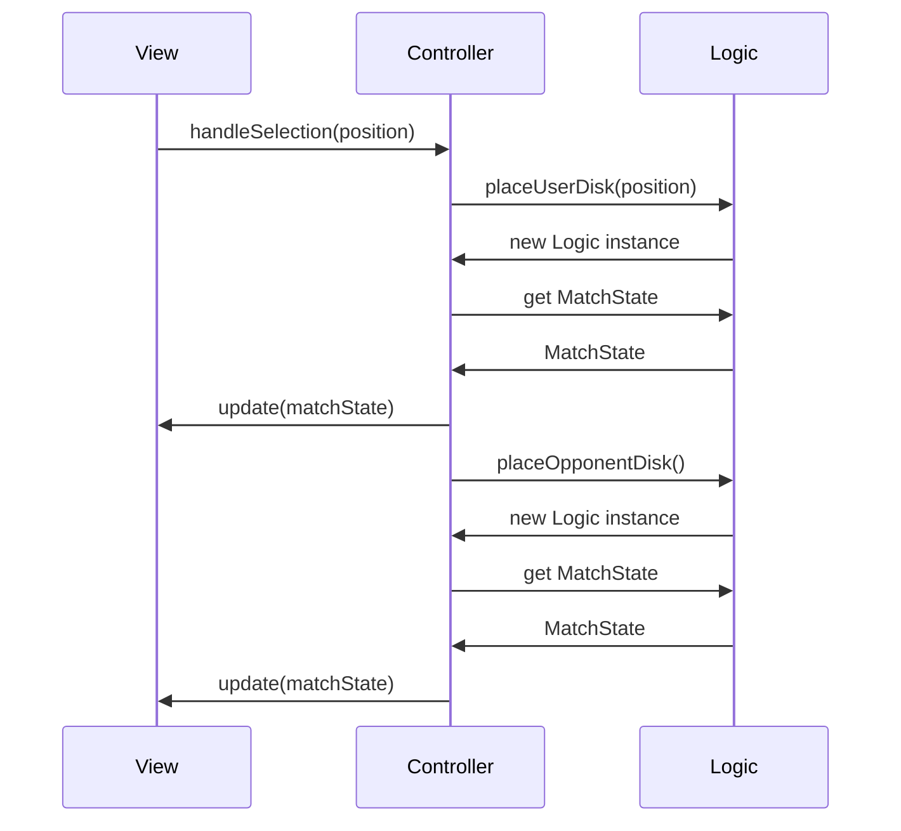
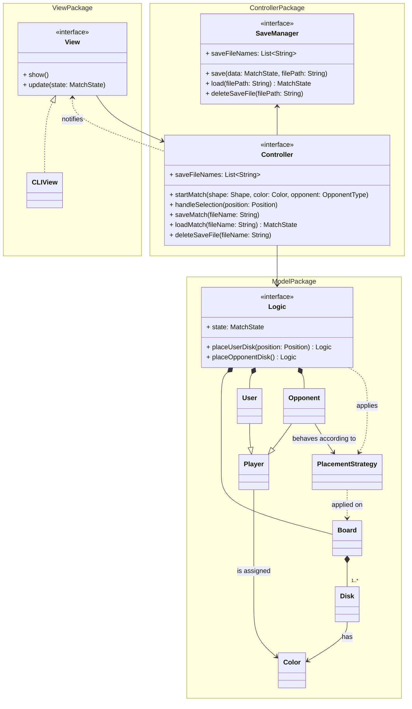

# Design architetturale

## Pattern architetturale adottato

Per l'architettura dell'applicazione, si è scelto di adottare il pattern Model-View-Controller (MVC), in quanto si concilia bene con la seguente suddivisione delle responsabilità:

- il Model incapsula l'intera logica di gioco;
- la View incapsula tutto ciò che concerne l'interfaccia utente;
- il Controller comunica con la View e, nell'arco di vita di una partita, con il Model per realizzare le funzionalità previste, e si occupa anche di interagire con componenti esterne all'applicazione qualora necessario (ad esempio, con il sistema operativo per la gestione dei file di salvataggio).

La scelta architetturale adottata comporta inoltre i seguenti vantaggi.

- Poiché tutto ciò che concerne l'interfaccia utente è isolato nel modulo View, una stessa implementazione di Controller e Model può essere utilizzata da diverse implementazioni di View: ad esempio, l'interfaccia utente da riga di comando potrebbe essere sostituita da un'interfaccia grafica senza dover apportare alcuna modifica al Controller (né tantomeno al Model).
- In maniera analoga, la logica di gioco incapsulata nel Model è riutilizzabile senza alcuna modifica qualora si volessero fare modifiche anche estese a tutto ciò che esula dalle regole del gioco (ad esempio, modifiche all'interfaccia utente o, in generale, alle funzionalità a contorno della partita).
- È possibile sviluppare e testare (attraverso unit test automatizzati) la logica di gioco in maniera totalmente disgiunta dal resto dell'applicazione. Ciò ha permesso, come primo obiettivo di sviluppo, di pervenire ad una prima implementazione della logica di gioco, il cui corretto comportamento fosse appurato dagli unit test. Ciò ha anche facilitato gli sviluppi successivi: qualora si riscontrasse un bug durante una partita e gli unit test provassero che il comportamento del Model fosse corretto, il bug doveva quindi essere ricondotto ad un errore nel Controller o nella View, riducendo il campo per quanto riguarda la causa del problema.
- Quanto citato nel punto precedente vale analogamente anche per il Controller.
- La separazione adottata permette di lavorare in parallelo sui tre moduli: ad esempio, durante lo sviluppo ha permesso ai tre membri del gruppo di lavorare in parallelo su interfaccia utente, interazione tra Model e Controller e gestione dei salvataggi.

## Architettura complessiva

Dopo aver individuato i tre macro-componenti sopra indicati, quali Model, View e Controller, si è innanzitutto deciso di raggruppare in un modulo distinto tutte le entità che concorrono alla realizzazione di uno stesso macro-componente, definendo quindi un modulo per il Model, un modulo per il Controller e un modulo per la View. Successivamente, si è passati alla progettazione delle interazioni tra le diverse entità, cercando di minimizzare le dipendenze sia intra-modulo che inter-modulo.

L'unica entità del modulo Model che comunica con l'esterno è `Logic`: l'unico modo per interagire con lo stato di una partita è attraverso una delle interfacce esposte da tale entità. Le operazioni che si possono effettuare sullo stato di una partita sono fondamentalmente tre: la lettura dello stato, la sua modifica attraverso una mossa dell'utente e la sua modifica attraverso una mossa dell'avversario.

Per quanto concerne la modifica dello stato del Model (il quale costituisce il core dell'applicazione), coerentemente con i principi della programmazione funzionale, si è ritenuto opportuno seguire il principio di immutabilità: ogni operazione che modifica `Logic` ritorna una nuova istanza di `Logic`, che è di fatto uno snapshot atomico dello stato corrente della partita. Tale approccio elimina la presenza di side-effects interni e quindi potenziali bug dovuti ad essi. Tale approccio è stato poi applicato anche a `Board` e `Disk`, le altre due entità il cui stato varia nel corso di una partita.

Per quanto riguarda la lettura dello stato del Model, invece di rendere direttamente accessibili le proprietà di `Logic` che descrivono lo stato della partita, si è scelto di esporre lo stato mediante un'unica proprietà di tipo `MatchState`, struttura dati immutabile che incapsula uno stato specifico di una partita. È stata presa questa scelta in ragione del fatto che la View deve poter leggere lo stato della partita per renderizzarlo: sarebbe infatti stato scorretto che la View leggesse lo stato della partita direttamente da `Logic`, poiché avrebbe introdotto una dipendenza diretta tra View e Model, violando il pattern MVC.

Successivamente, è stata progettata l'interazione tra View e Controller. Innanzitutto, è necessario che la View comunichi con il Controller al fine di innescare la creazione di una partita e comunicare la posizione scelta dall'utente ad ogni suo turno: pertanto, la View ha un riferimento interno al Controller. Anche il Controller ha necessità di comunicare con la View per notificare ad essa lo stato della partita aggiornato dopo una mossa di un giocatore; tuttavia, introdurre un riferimento interno alla View nel Controller avrebbe creato una dipendenza ciclica tra View e Controller. Si è pertanto stabilito, per la fase di design di dettaglio, l'obiettivo di trovare una soluzione che permettesse al Controller di notificare lo stato corrente della partita alla View senza introdurre una dipendenza diretta da essa.

A titolo esemplificativo, il seguente diagramma riassume l'interazione pianificata tra View, Controller e Model per la gestione delle mosse, nello scenario in cui l'utente esegua una mossa a cui segua una mossa dell'avversario. (Nota: le operazioni su `Logic` effettuate dopo la creazione di una nuova istanza di `Logic` sono da intendersi svolte sopra la nuova istanza).

Infine, ai fini delle funzionalità di creazione, caricamento e cancellazione di salvataggi di una partita, sono stati previsti appositi metodi e proprietà esposti dal Controller e un'entità aggiuntiva (`SaveManager`) a cui il Controller delega tali compiti.

Tutte le entità e le modalità di interazione tra di esse descritte nella presente sezione sono raffigurate nel seguente diagramma architetturale.

