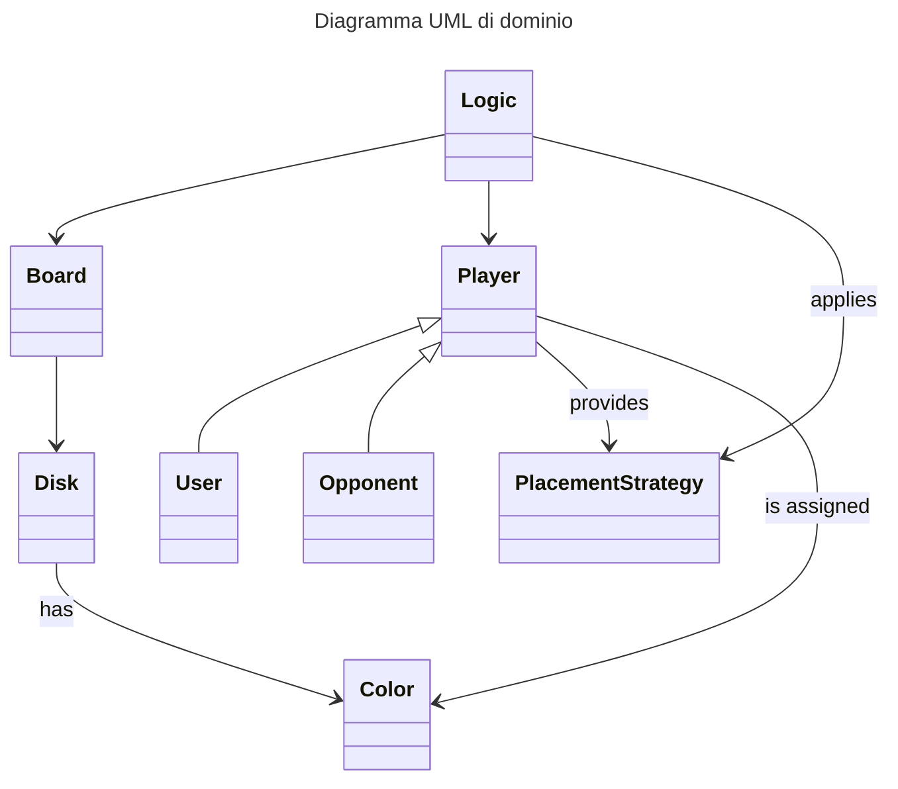
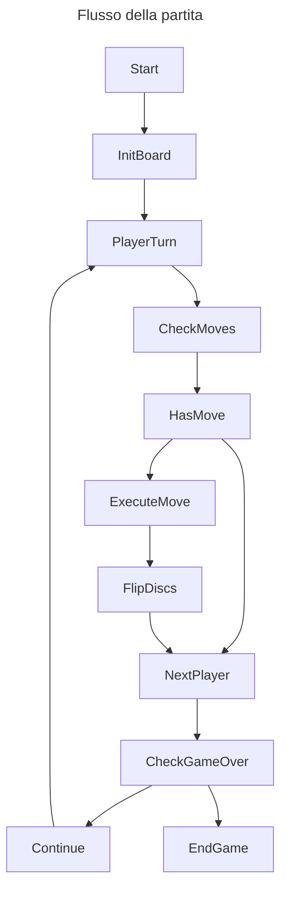

# Requisiti

## Requisiti di business

- Creazione di un'applicazione che permetta di giocare al gioco da tavolo Othello, in modalità single player contro un avversario virtuale autonomo.
- Realizzazione dell'applicazione entro due mesi. La versione finale dell'applicazione realizzata entro tale arco di tempo deve soddisfare i requisiti funzionali definiti nella sezione [Requisiti funzionali](#requisiti-funzionali)

## Analisi del dominio

Il gioco prevede due giocatori, ciascuno dei quali possiede un determinato numero di pedine, le quali sono di colore nero da un lato e di colore bianco dall'altro. Ad ogni giocatore è assegnato uno dei due colori. Il terreno di gioco, diviso in celle, è di forma quadrata o rettangolare.

Prima di iniziare a giocare, si posizionano due pedine bianche e due nere nelle quattro caselle centrali del terreno di gioco, in modo da creare una configurazione a X con le pedine bianche lungo una diagonale e con le pedine nere lungo l'altra diagonale.

Il giocatore che inizia il gioco è quello a cui è assegnato il colore nero. A turni alterni, ciascun giocatore effettua una mossa, che consiste nell'appoggiare una nuova pedina in una casella vuota in modo che essa imprigioni una o più pedine avversarie. Con il termine "imprigionare", si intende chiudere il lato opposto ancora libero di una pedina o sequenza di pedine avversarie. Si possono imprigionare pedine in orizzontale, in verticale e in diagonale. Una pedina, una volta imprigionata, viene rovesciata e diventa di proprietà di chi ha eseguito la mossa.

Sono ammesse solo mosse con le quali si gira almeno una pedina, altrimenti il giocatore salta il turno. Non è possibile passare il turno se esiste almeno una mossa valida.

Non è possibile spostare in un'altra cella una pedina che è già stata posizionata sul terreno di gioco.

La partita termina in due condizioni: quando tutte le caselle di gioco sono occupate oppure quando nessuno dei due giocatori ha mosse valide da effettuare.

La modalità classica del gioco prevede che, al termine della partita, il vincitore sia il giocatore che ha il maggior numero di pedine del proprio colore sul terreno di gioco.

È però nota anche un'altra modalità di gioco – detta "a perdere" – che, al contrario, prevede che il vincitore sia il giocatore che al termine della partita ha il numero minore di proprie pedine sul terreno di gioco.

## Requisiti funzionali

### Utente

### Sistema

## Requisiti non funzionali

## Requisiti di implementazione

- Realizzare l'applicazione interamente in Scala, salvo eventualmente realizzare piccole parti dell'applicazione in TuProlog qualora sia ritenuto opportuno per valide motivazioni tecniche.
