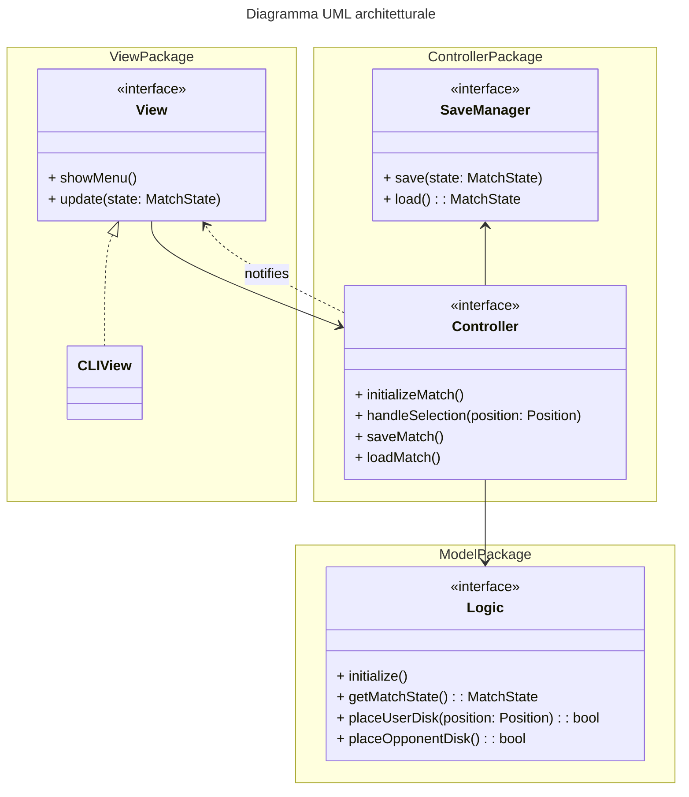
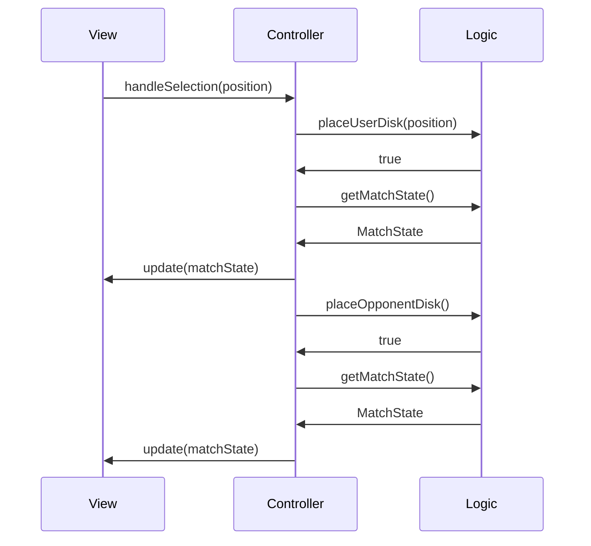

# Design architetturale

## Spiegazione dell'architettura

## Diagramma dei componenti

Scenario: iterazione del loop di gioco tra View, Controller e Model, nell'eventualità di una mossa legale da parte dell'utente a cui segue una mossa dell'avversario.
