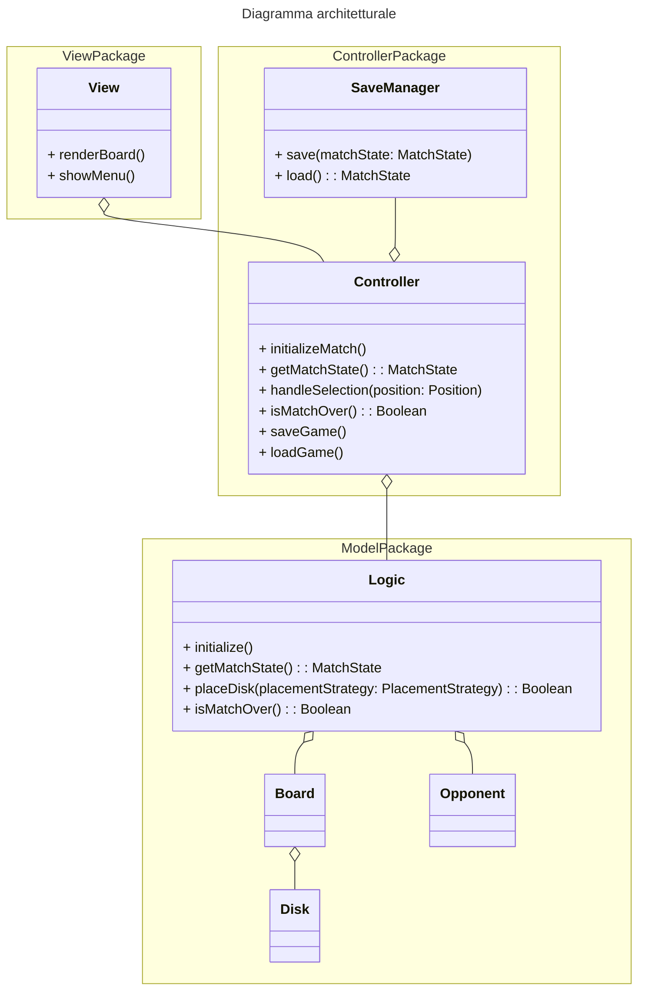

# Design architetturale

## Spiegazione dell'architettura

## Diagramma dei componenti

```mermaid
---
title: Diagramma architetturale
---
classDiagram
  namespace ViewPackage {
    class View {
      + renderBoard()
      + showMenu()
    }
  }
  namespace ControllerPackage {
    class Controller {
      + initializeMatch()
      + getMatchState(): MatchState
      + handleSelection(position: Position)
      + isMatchOver(): Boolean
      + saveGame()
      + loadGame()
    }
    class SaveManager {
      + save(matchState: MatchState)
      + load(): MatchState
    }
  }
  namespace ModelPackage {
    class Board {
    }
    class Disk {
    }
    class Logic {
      + initialize()
      + getMatchState(): MatchState
      + placeDisk(placementStrategy: PlacementStrategy): Boolean
      + isMatchOver(): Boolean
    }
    class Opponent {
    }
  }

  View o-- Controller
  Controller o-- Logic
  SaveManager --o Controller
  
  Logic o-- Board
  Logic o-- Opponent
  Board o-- Disk
```
