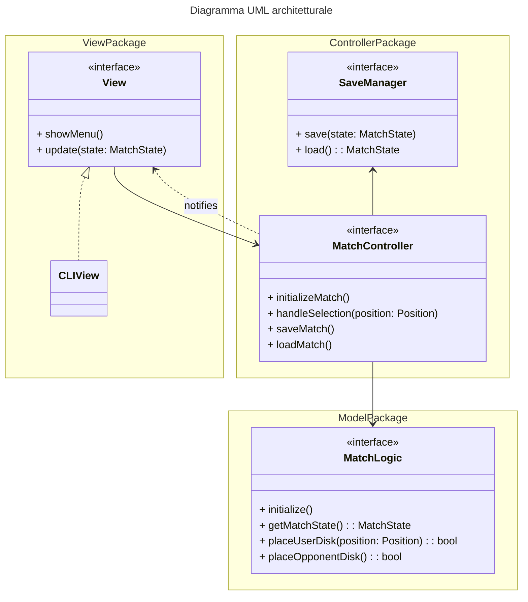
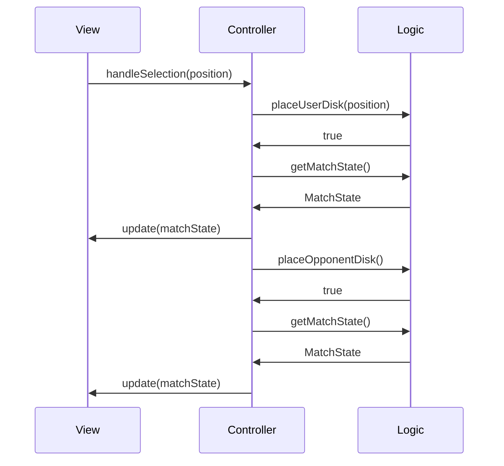

# Design architetturale

## Spiegazione dell'architettura

L'architettura del gioco è stata progettata seguendo il pattern architetturale Model-View-Controller (MVC).

Dato un gioco da tavolo come Othello, l'architettura MVC è particolarmente adatta perché permette di separare le responsabilità tra la logica del gioco (Model), l'interfaccia utente (View) e il controllo del flusso dell'applicazione (Controller).

Permette di avere la possibilità in futuro di sostituire facilmente l'interfaccia utente da terminale con un'interfaccia grafica, senza dover modificare la logica del gioco o il controller, e viceversa.

Facilita anche la testabilità dei singoli componenti, sfruttando `Mockito` per creare *placeholder* dei componenti non ancora sviluppati, o per isolarli durante i test.

## Diagramma dei componenti

## Interazione tra View, Controller e Model

Iterazione del loop di gioco tra View, Controller e Model, nell'eventualità di una mossa legale da parte dell'utente a cui segue una mossa dell'avversario.

