# Design di dettaglio

## Aggiornamento View

Gestione dell'aggiornamento della View a seguito di cambiamenti nel Model, secondo il pattern Observer

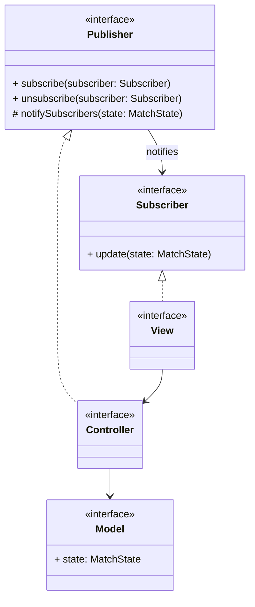

---

## Player

La struttura del componente Player è stata progettata come un'interfaccia, che rappresenta un giocatore generico, che può fare scelte di posizionamento dei dischi sulla scacchiera.

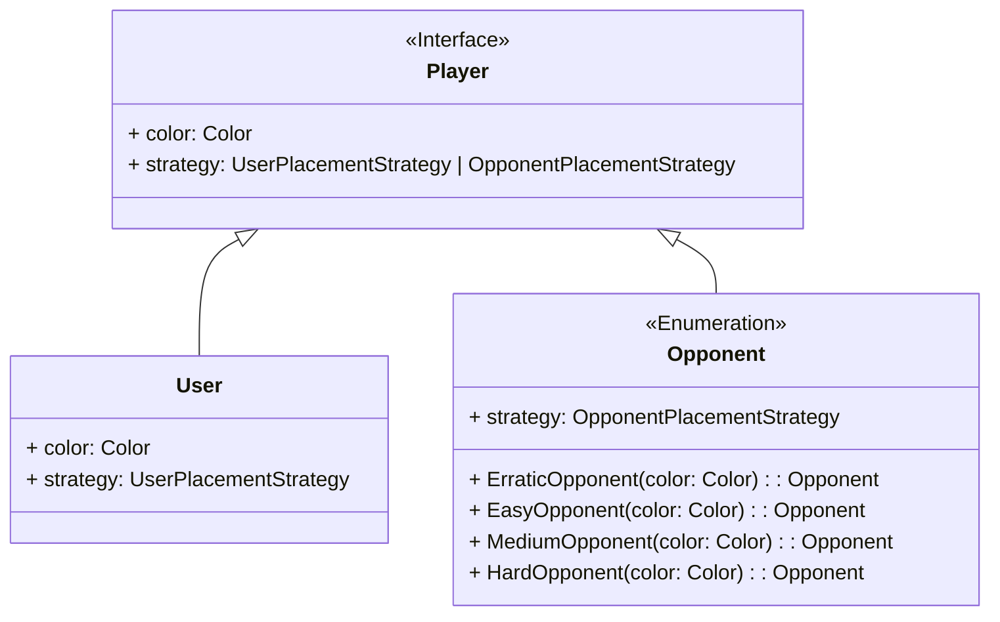

## PlacementStrategy

La placement strategy è una interfaccia che permette di definire il comportamento del giocatore, sia esso umano o virtuale.

Per il giocatore umano, la placement strategy consiste semplicemente nel leggere l'input dell'utente e restituire la posizione selezionata.\
Mentre per l'avversario virtuale, la placement strategy consiste nel calcolare la mossa da eseguire in base a uno stile di gioco predefinito, come ad esempio massimizzare il numero di pedine catturate o minimizzare il numero di pedine catturate dall'avversario.

- Pattern Strategy

  La "strategia di mossa" consiste nel calcolare come il giocatore sceglie la posizione in cui piazzare il disco.\
  È una funzione che data una informazione restituisce la posizione in cui il giocatore vuole piazzare il disco.

  Questo approccio permette di separare la logica del gioco dalla logica decisionale dei giocatori, rendendo più semplice l'implementazione di diversi tipi di avversari virtuali con differenti stili di gioco.

  Inoltre, rende più semplice l'integrazione nella logica del gioco, in quanto è possibile chiamare la strategia di mossa del giocatore senza dover distinguere tra giocatore umano e avversario virtuale.

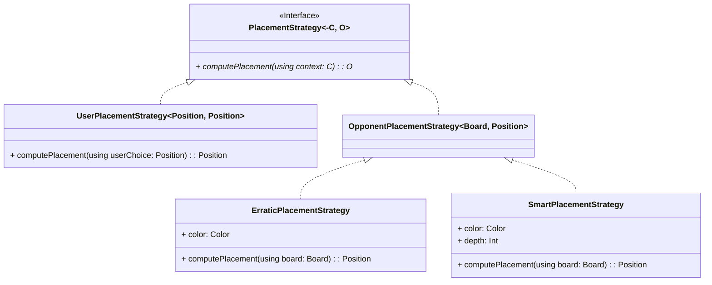

### Scenario: calcolo delle mosse

Il controller delega alla logica di gioco il compito di calcolare la mossa da eseguire, fornendo alla logica del gioco la scelta dell'utente, mentre le informazioni necessarie per calcolare la mossa dell'avversario sono già presenti all'interno della logica del gioco.

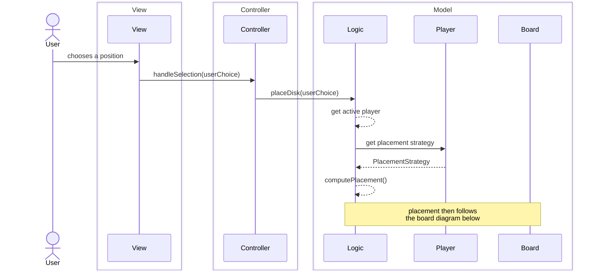

---

### SaveManager

Il save manager è un componente del controller che si occupa di gestire il salvataggio e il caricamento dello stato della partita.

Il save manager fornisce due metodi principali:

- `save(matchState: MatchState)`: salva lo stato della partita corrente su un file.
- `load()`: carica lo stato della partita da un file.

Solo una istanza del save manager è presente all'interno del controller.\
Questa istanza può salvare un unico stato della partita alla volta, e il salvataggio sovrascrive eventuali salvataggio precedente.

Il caricamento tenta di leggere lo stato della partita da un file, e se il file non esiste o è corrotto, il save manager riporta un errore al controller.

- Pattern Adapter

    Nel modulo `SaveManager` viene usato il pattern ***adapter***.\
    Il modulo esporrà un'interfaccia unica per le operazioni di salvataggio e caricamento, delegando la conversione e la gestione dei formati specifici ad *adapter* concreti (es. JSON, XML, binario).

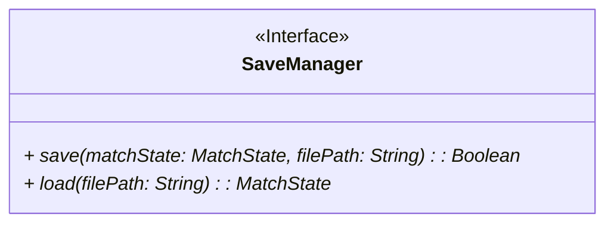

#### Scenario: salvataggio di una partita

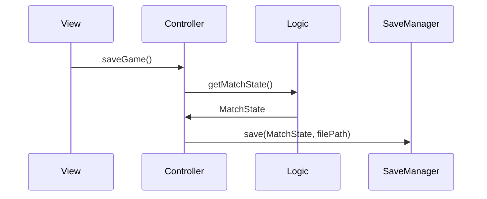

#### Scenario: caricamento di una partita

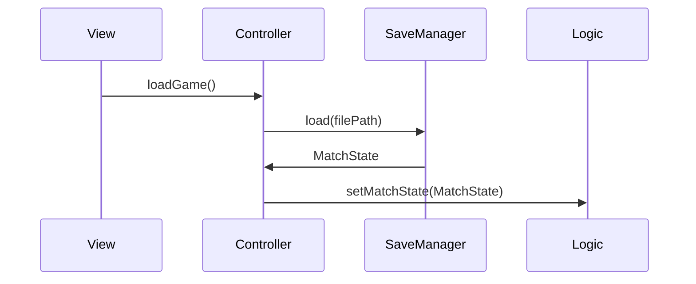

---

### Disk

`Disk` è un componente del Model che modella le pedine (o dischi) del gioco. 

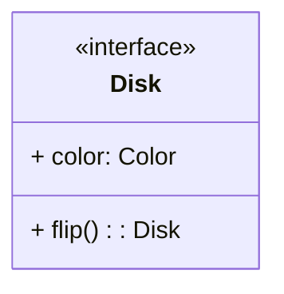

Nello specifico:

- `color` restituisce il suo colore;
- `flip()` capovolge il disco (cambiandone il colore).

Quando viene eseguito un `flip()` viene creato un nuovo disco con il colore opposto a quello precedente, per semplificare la cosa verrà usato il **factory pattern**.

Questo permette anche di mantenere facilmente l'immutabilità dei dischi, evitando possibili *side-effect*.

### Board e BoardComputations

`Board` è un componente del Model che modella la scacchiera su cui si svolge la partita.

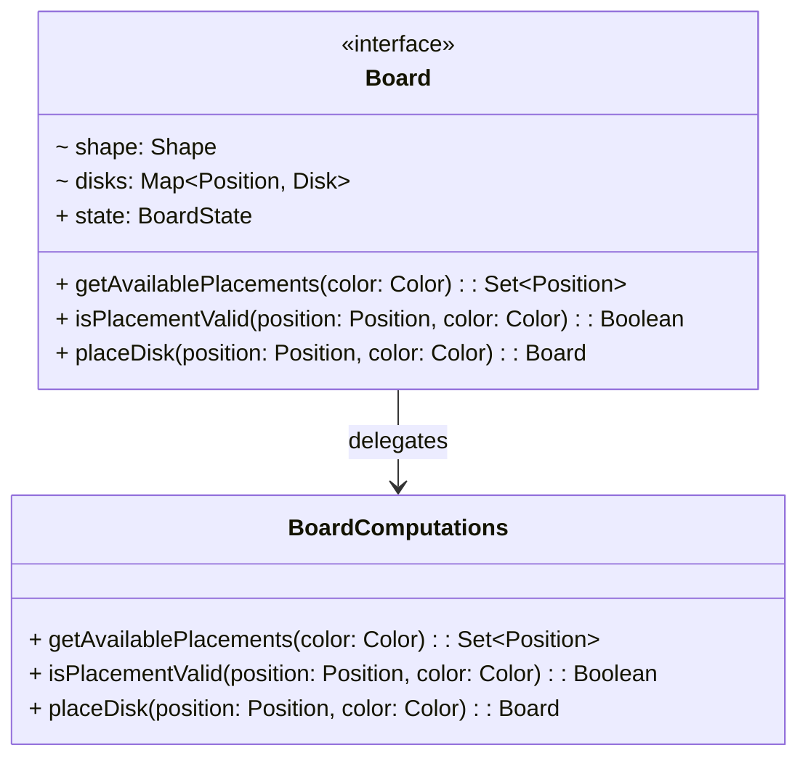

In particolare:

- `shape` la forma della scacchiera;
- `disks` tutti i dischi presenti sulla scacchiera; 
- `state` lo stato attuale della scacchiera;
- `isPlacementValid()` controlla se la mossa selezionata è valida in base alle regole del gioco;
- `getAvailablePlacements()` restituisce tutte le posizioni delle possibili mosse valide;
- `placeDisk()` inserisce un nuovo disco sulla scacchiera, capovolgendo poi i dischi catturati da quest'ultimo, restituendo così una nuova scacchiera con le informazioni aggiornate;

Eseguendo `placeDisk()` viene creata una nuova `Board` invece che aggiornare quelle attuale, questo viene fatto per mantenere l'immutabilità della `Board` e quindi garantire l'eliminazione di *side-effect*; per semplificare questa operazione viene utilizzato il **factory pattern**.

Nell'implementazione della Board viene utilizzato il design pattern: **delegation pattern**: 

- la `Board` delega i calcoli associati alle sue operazioni alla classe `BoardComputations`;
- nello specifico il pattern viene applicato sia delegando le operazioni a `BoardComputations`, sia passando a quest'ultima un riferimento alla `Board` per permetterle di operare sull'istanza corrente della stessa.

### Controller

`Controller` è un componente del Controller che si occupa del coordinamento della partita.

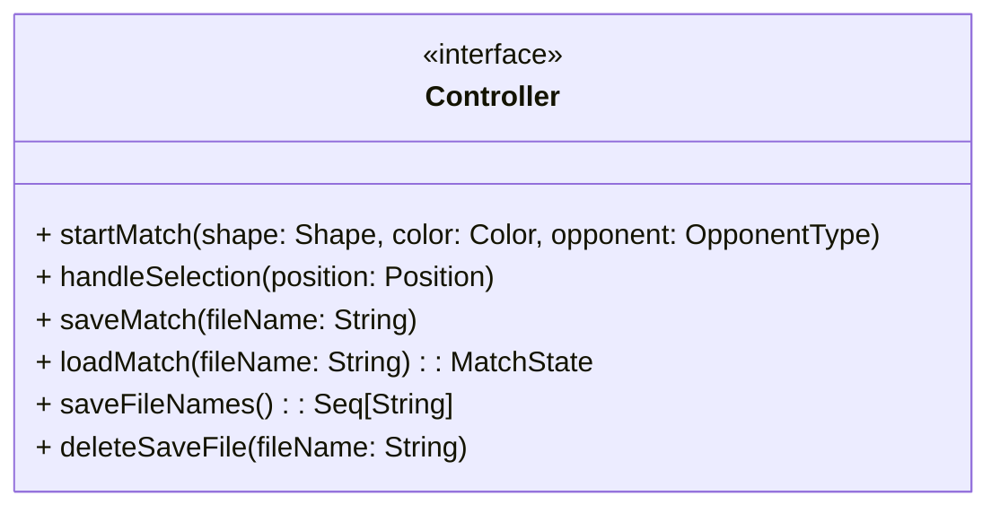

In dettaglio:

- `startMatch()` crea una nuova partita istanziando tutti i componenti necessari; 
- `handleSelection()` si occupa di gestire la posizione in cui l'utente vuole posizionare un nuovo disco e gestisce il turno dell'avversario di conseguenza;
- `saveMatch()` salva lo stato della partita attuale;
- `loadMatch()` carica il salvataggio di una partita;
- `saveFileNames()` restituisce una sequenza contenente il nome dei *file* di salvataggio esistenti;
- `deleteSaveFile()` cancella il *file* di salvataggio richiesto.

### Interazione tra Controller, Logic e Board

Per eseguire una mossa valida dell'utente o dell'avversario:

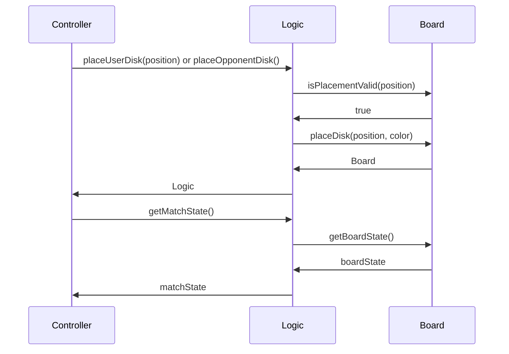

In caso `isPlacementValid()` restituisse `false` il flusso tornerebbe a `Controller`.
