# Design di dettaglio

## Model

### Struttura complessiva

Per prima cosa, in questa fase sono state maggiormente dettagliate le interazioni tra le principali entità del Model, già delineate in precedenza. Il seguente diagramma mostra proprietà e metodi esposti da ciascuna entità.

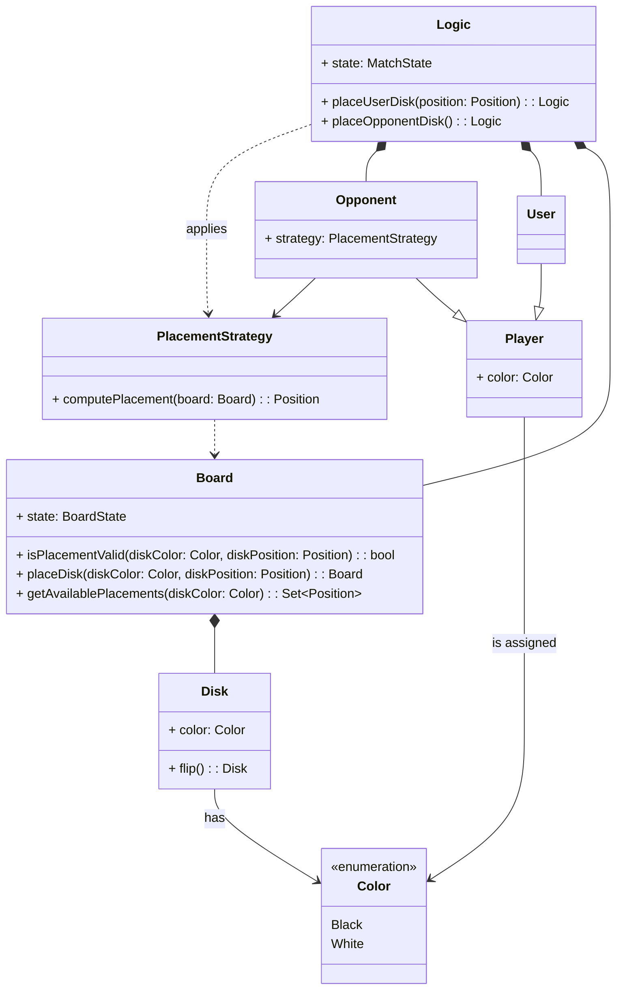

Come già citato nell'analisi di dominio, l'avversario (`Opponent`) effettua le proprie mosse seguendo una specifica strategia (`PlacementStrategy`), rappresentabile come una funzione che prende in input lo stato corrente del terreno di gioco (`Board`) e restituisce in output la posizione in cui effettuare la mossa, decisa secondo uno specifico algoritmo. L'applicazione di tale funzione è effettuata dalla `Logic` ad ogni turno dell'avversario virtuale.

Oltre all'applicazione della strategia dell'avversario per conoscere la sua prossima mossa, la `Logic` deve comunicare con la `Board` anche per le seguenti operazioni:

- ottenerne lo stato (necessario affinché la `Logic` possa restituire lo stato completo della partita);
- sapere se il posizionamento di un disco di un certo colore in una specifica posizione è valido;
- posizionare un disco (operazione che implica anche il rovesciamento dei dischi catturati, effettiuato dalla `Board`);
- conoscere i posizionamenti validi che un giocatore può effettuare dato lo stato corrente della `Board` (sia per stabilire se un giocatore non ha mosse valide disponibili, sia affinché possano essere fornite all'utente le mosse valide che può effettuare).

Da notare che il metodo `placeDisk()` della `Board`, che ne modifica lo stato, restituisce una nuova istanza di `Board`, coerentemente con il principio di immutabilità adottato anche per la `Logic`; analogo principio è stato adottato per il metodo `flip()` dei `Disk` (che ne effettua il rovesciamento).

Nel diagramma sottostante è inoltre dettagliata la struttura di `MatchState` (che descrive uno stato della una partita) e delle sue sottoparti.

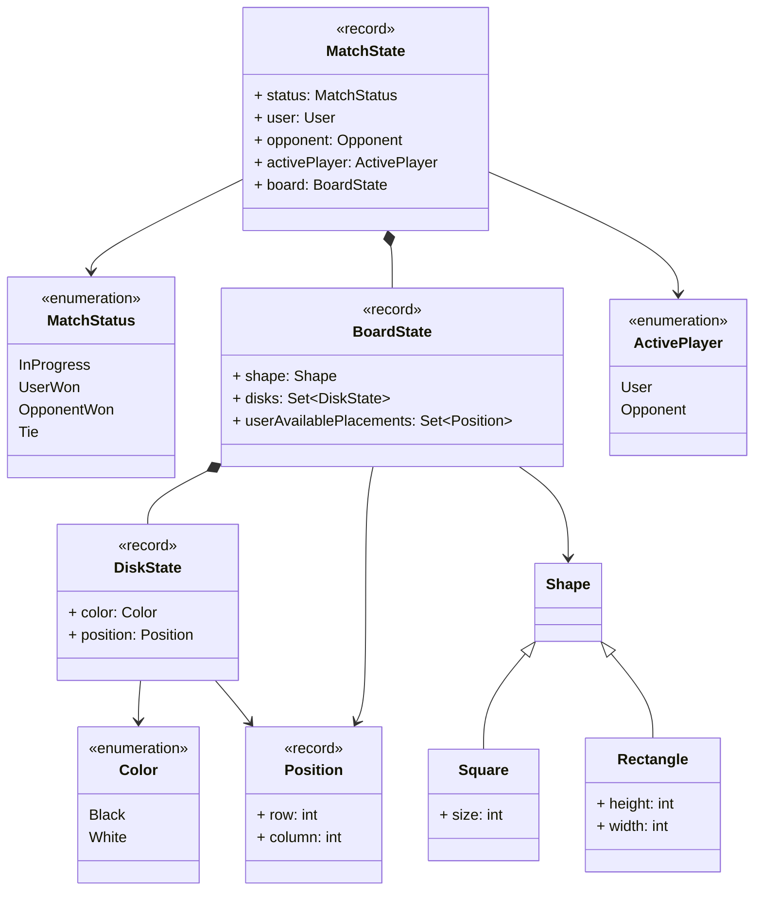

### Board

`Disk` è un componente del Model che modella le pedine (o dischi) del gioco.

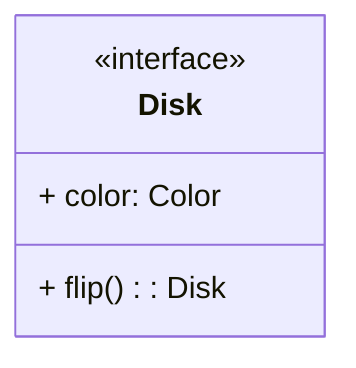

Nello specifico:

- `color` restituisce il suo colore;
- `flip()` capovolge il disco (cambiandone il colore).

Quando viene eseguito un `flip()` viene creato un nuovo disco con il colore opposto a quello precedente, per semplificare la cosa verrà usato il **factory pattern**.

Questo permette anche di mantenere facilmente l'immutabilità dei dischi, evitando possibili *side-effect*.

`Board` è un componente del Model che modella la scacchiera su cui si svolge la partita.

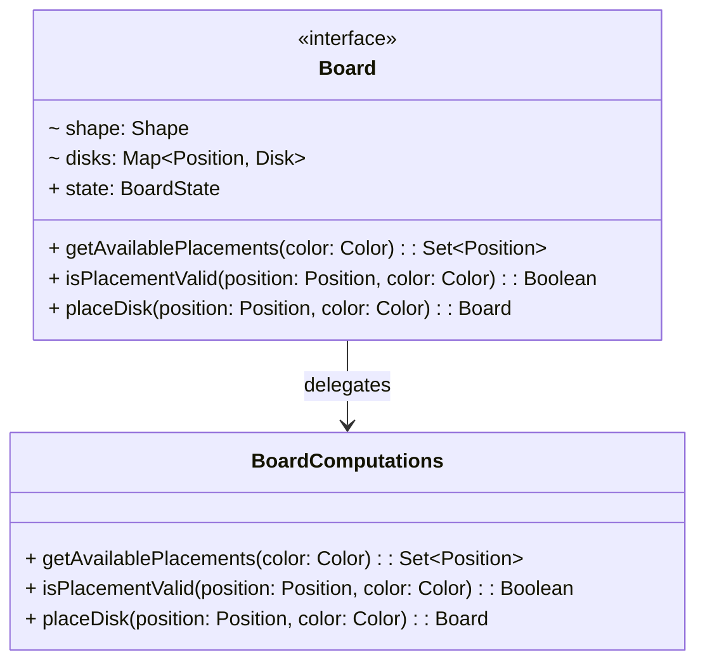

In particolare:

- `shape` la forma della scacchiera;
- `disks` tutti i dischi presenti sulla scacchiera;
- `state` lo stato attuale della scacchiera;
- `isPlacementValid()` controlla se la mossa selezionata è valida in base alle regole del gioco;
- `getAvailablePlacements()` restituisce tutte le posizioni delle possibili mosse valide;
- `placeDisk()` inserisce un nuovo disco sulla scacchiera, capovolgendo poi i dischi catturati da quest'ultimo, restituendo così una nuova scacchiera con le informazioni aggiornate;

Eseguendo `placeDisk()` viene creata una nuova `Board` invece che aggiornare quelle attuale, questo viene fatto per mantenere l'immutabilità della `Board` e quindi garantire l'eliminazione di *side-effect*; per semplificare questa operazione viene utilizzato il **factory pattern**.

Nell'implementazione della Board viene utilizzato il design pattern: **delegation pattern**:

- la `Board` delega i calcoli associati alle sue operazioni alla classe `BoardComputations`;
- nello specifico il pattern viene applicato sia delegando le operazioni a `BoardComputations`, sia passando a quest'ultima un riferimento alla `Board` per permetterle di operare sull'istanza corrente della stessa.

### Giocatori

La struttura del componente Player è stata progettata come un'interfaccia, che rappresenta un giocatore generico, che può fare scelte di posizionamento dei dischi sulla scacchiera.

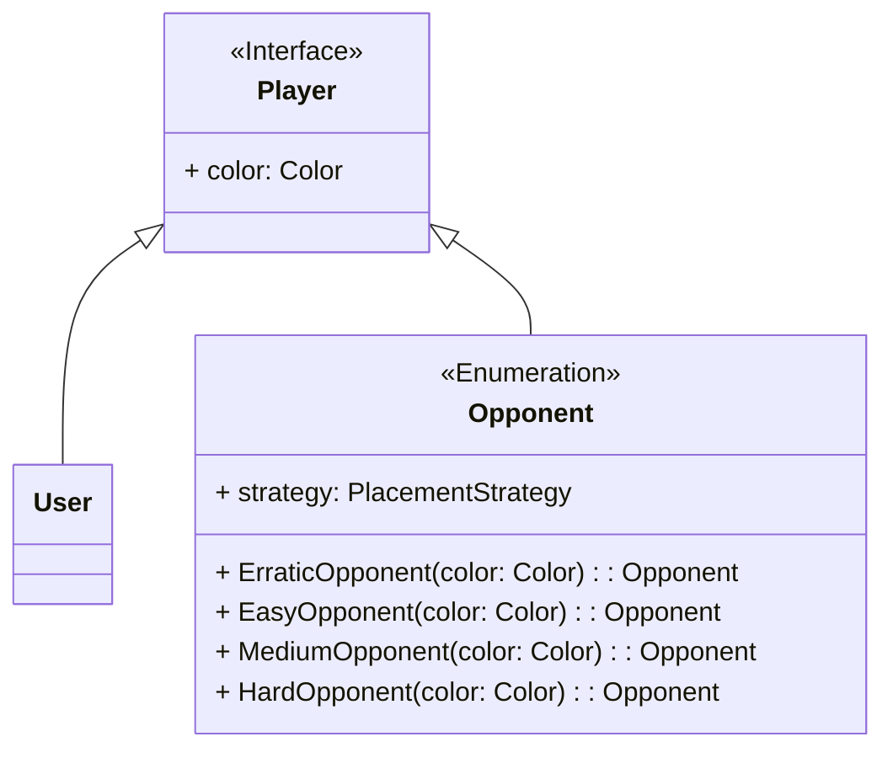

### Strategie dell'avversario

La placement strategy è una interfaccia che permette di definire il comportamento di un giocatore.

Per l'avversario virtuale, la placement strategy consiste nel calcolare la mossa da eseguire in base a uno stile di gioco predefinito, come ad esempio massimizzare il numero di pedine catturate o minimizzare il numero di pedine catturate dall'avversario.

- Pattern Strategy

  La "strategia di mossa" consiste nel calcolare come il giocatore sceglie la posizione in cui piazzare il disco.\
  È una funzione che data una informazione restituisce la posizione in cui il giocatore vuole piazzare il disco.

  Questo approccio permette di separare la logica del gioco dalla logica decisionale dei giocatori, rendendo più semplice l'implementazione di diversi tipi di avversari virtuali con differenti stili di gioco.

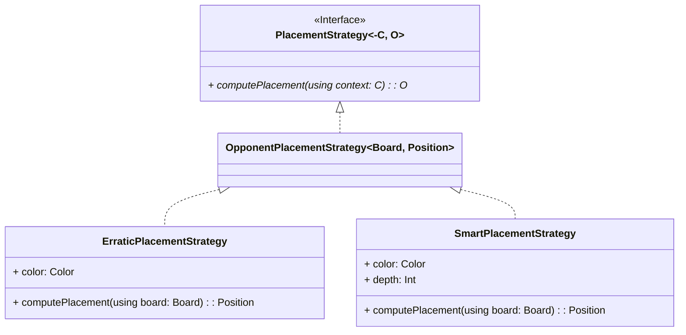

#### Scenario: calcolo delle mosse

## Controller

`Controller` è un componente del Controller che si occupa del coordinamento della partita.

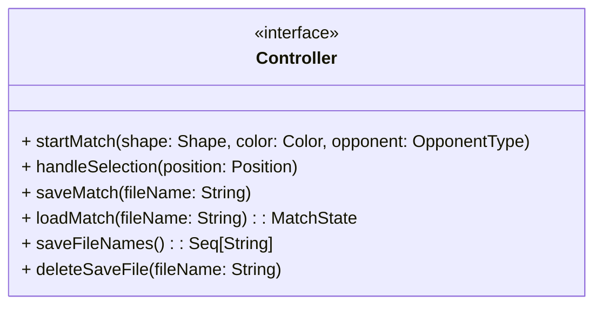

In dettaglio:

- `startMatch()` crea una nuova partita istanziando tutti i componenti necessari; 
- `handleSelection()` si occupa di gestire la posizione in cui l'utente vuole posizionare un nuovo disco e gestisce il turno dell'avversario di conseguenza;
- `saveMatch()` salva lo stato della partita attuale;
- `loadMatch()` carica il salvataggio di una partita;
- `saveFileNames()` restituisce una sequenza contenente il nome dei *file* di salvataggio esistenti;
- `deleteSaveFile()` cancella il *file* di salvataggio richiesto.

### SaveManager

Il save manager è un componente del controller che si occupa di gestire il salvataggio e il caricamento delle partite.

Solo una istanza del save manager è presente all'interno del controller.\
Questa istanza può salvare più partite, ognuna in un file separato all'interno di una cartella passata come parametro al momento della creazione del save manager.

- Pattern Adapter

    Nel modulo `SaveManager` viene usato il pattern ***adapter***.\
    Il modulo esporrà un'interfaccia unica per le operazioni di salvataggio e caricamento, delegando la conversione e la gestione dei formati specifici ad *adapter* concreti (es. JSON, XML, binario).

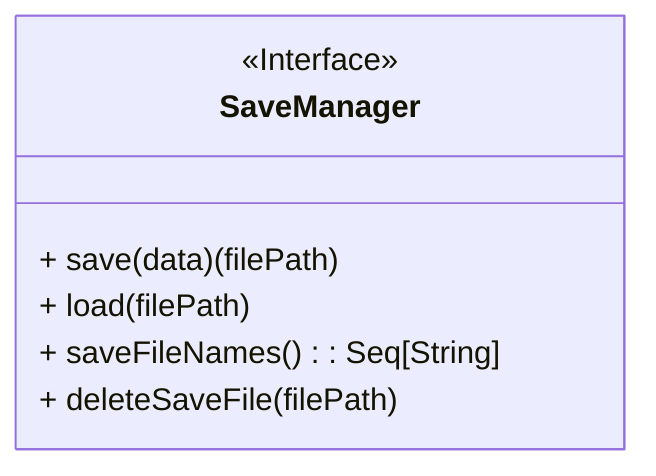

Data la natura delle operazioni di I/O, le chiamate al save manager possono fallire.\
Per questo motivo i metodi `save()`, `load()` e `deleteSaveFile()` in caso di fallimento, l'oggetto restituito conterrà un'eccezione che descrive il motivo.

#### Scenario: salvataggio di una partita

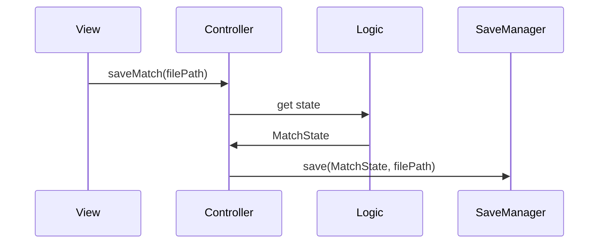

#### Scenario: caricamento di una partita

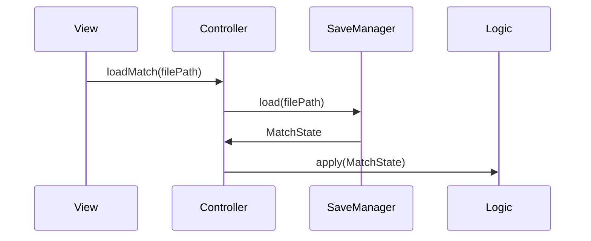

## Propagazione degli aggiornamenti di stato di una partita

Come accennato nel capitolo precedente, uno degli obiettivi del design di dettaglio era trovare una soluzione che permettesse di notificare gli aggiornamenti di stato della partita alla View senza introdurre una dipendenza diretta dal Controller alla View, considerato che vi era già l'esigenza di una dipendenza dalla View al Controller e far coesistere entrambe le dipendenze avrebbe introdotto una dipendenza ciclica tra View e Controller.

Tale soluzione è stata individuata nel pattern Observer, applicato come segue.

Nell'atto di notifica di un aggiornamento, si distinguono due categorie di entità:

- l'entità che emette gli aggiornamenti (`Publisher`);
- le entità che devono essere notificate riguardo agli aggiornamenti pubblicati, le quali si registrano presso il `Publisher` (e pertanto sono dette `Subscriber`) in modo che esso possa notificarle di propria iniziativa nel momento in cui c'è un nuovo aggiornamento.

Nel contesto dell'architettura progettata, il ruolo di `Publisher` è ricoperto dal Controller, il quale riceve gli aggiornamenti di stato della partita dal Model, mentre la View ha il ruolo di `Subscriber`.

Quando si inizia una nuova partita, la View si registra come `Subscriber` presso il Controller attraverso il metodo `subscribe()`. Ad ogni turno, il Controller legge lo stato del Model, il quale lo espone mediante la proprietà `state` della `Logic`. Il Controller propaga quindi lo stato aggiornato ai `Subscriber` registrati attraverso il metodo `notifySubscribers()`, il quale chiama il metodo `update` di ogni `Subscriber`. Al termine della partita, la View si disiscrive dal Controller attraverso il metodo `unsubscribe()`.

Allo stato attuale, l'unico `Subscriber` previsto è la View ai fini del rendering dello stato della partita, ma si potrebbero chiaramente aggiungere altri `Subscriber` per ulteriori funzionalità (ad esempio, un logger che registri tutti gli stati della partita su file, oppure un'entità di gestione dell'audio che riproduca effetti sonori ad ogni cambio di stato).

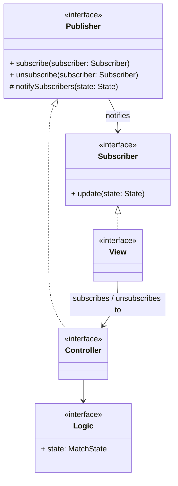

## View

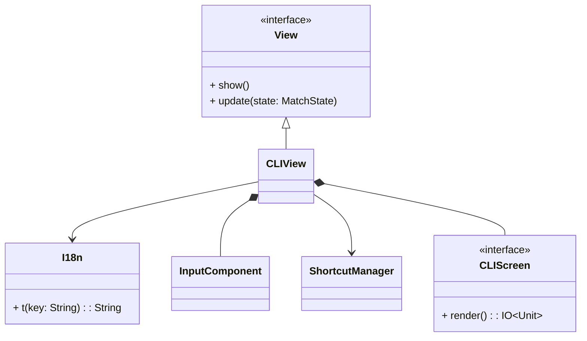
