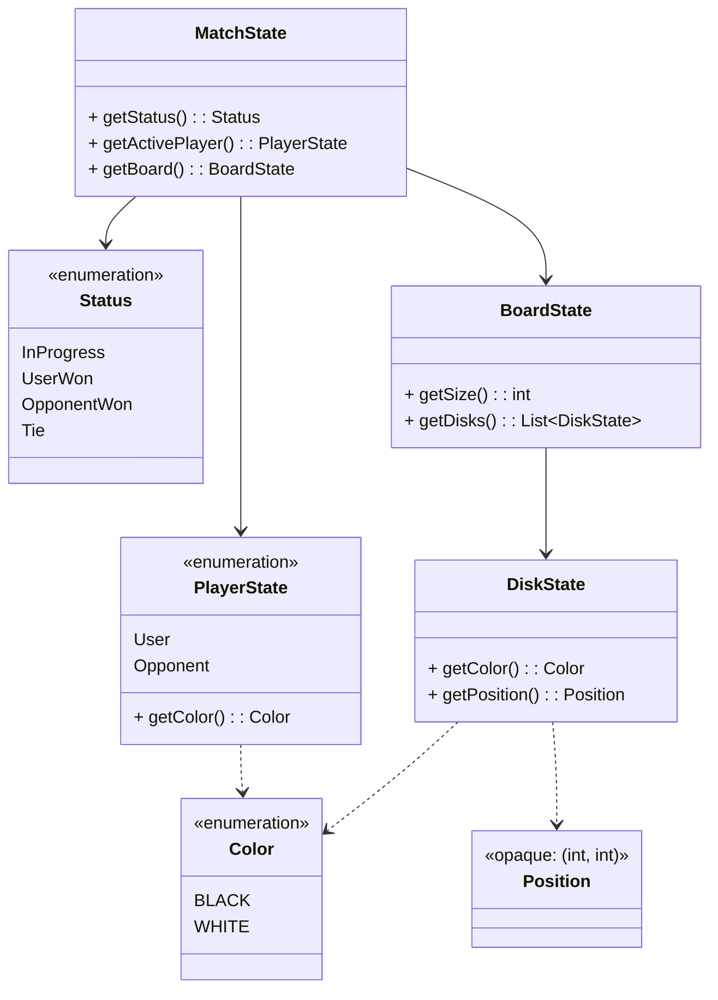
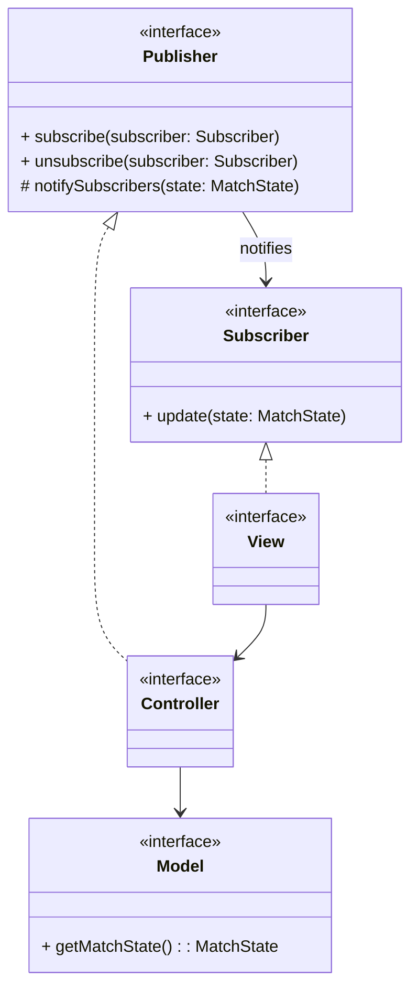
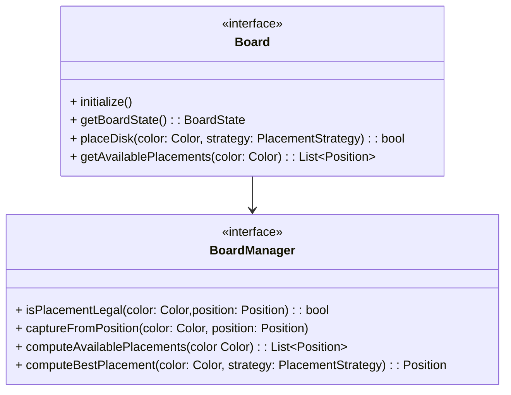

# Design di dettaglio

Struttura MatchState:

```mermaid
classDiagram 
    class MatchState {
        + getStatus(): Status
        + getActivePlayer(): PlayerState
        + getBoard(): BoardState
    }
    class Status {
        <<enumeration>>
        InProgress
        UserWon
        OpponentWon
        Tie
    }
    class PlayerState {
        <<enumeration>>
        User
        Opponent
        + getColor(): Color
    }
    class BoardState {
        + getSize(): int
        + getDisks(): List~DiskState~
    }
    class DiskState {
        + getColor(): Color
        + getPosition(): Position
    }
    class Color {
        <<enumeration>>
        BLACK
        WHITE
    }
    class Position {
        <<opaque: (int, int)>>
    }

    MatchState --> BoardState
    MatchState --> Status
    MatchState --> PlayerState
    PlayerState ..> Color
    BoardState --> DiskState
    DiskState ..> Color
    DiskState ..> Position
```

Gestione dell'aggiornamento della View a seguito di cambiamenti nel Model, secondo il pattern Observer:

```mermaid
classDiagram
    class Model {
        <<interface>>
        + getMatchState(): MatchState
    }
    class Publisher {
        <<interface>>
        + subscribe(subscriber: Subscriber)
        + unsubscribe(subscriber: Subscriber)
        # notifySubscribers(state: MatchState)
    }
    class Controller {
        <<interface>>
    }
    class Subscriber {
        <<interface>>
        + update(state: MatchState)
    }
    class View {
        <<interface>>
    }

    Controller --> Model
    Publisher --> Subscriber: notifies
    Publisher <|.. Controller
    Subscriber <|.. View
    View --> Controller
```

BoardManager:

```mermaid
classDiagram
    class Board {
        <<interface>>
        + initialize()
        + getBoardState(): BoardState
        + placeDisk(color: Color, strategy: PlacementStrategy): bool
        + getAvailablePlacements(color: Color): List~Position~
    }
    class BoardManager {
        <<interface>>
        + isPlacementLegal(color: Color,position: Position): bool
        + captureFromPosition(color: Color, position: Position)
        + computeAvailablePlacements(color Color): List~Position~
        + computeBestPlacement(color: Color, strategy: PlacementStrategy): Position
    }

    Board --> BoardManager
```