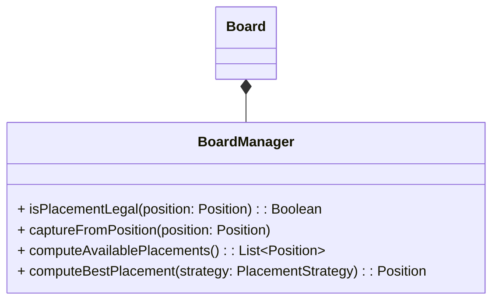
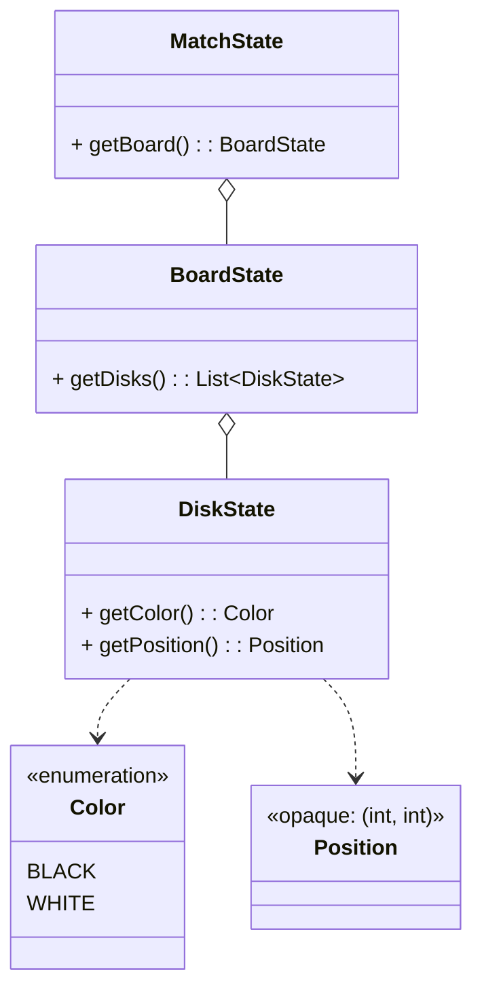
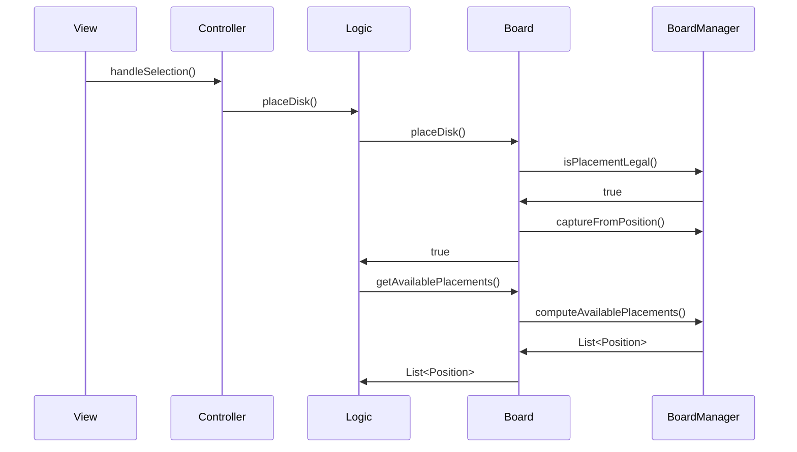
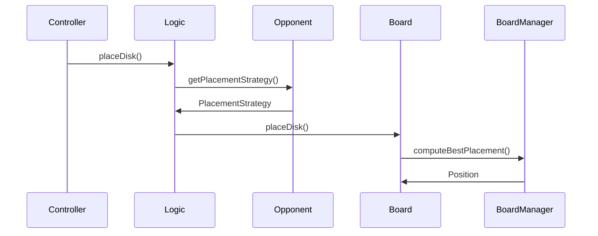

# Design di dettaglio

BoardManager:

```mermaid
classDiagram
    class Board
    class BoardManager {
        + isPlacementLegal(position: Position): Boolean
        + captureFromPosition(position: Position)
        + computeAvailablePlacements(): List~Position~
        + computeBestPlacement(strategy: PlacementStrategy): Position
    }

    Board *-- BoardManager
```

Struttura MatchState:

```mermaid
classDiagram 
    class MatchState {
        + getBoard(): BoardState
    }
    class BoardState {
        + getDisks(): List~DiskState~
    }
    class DiskState {
        + getColor(): Color
        + getPosition(): Position
    }
    class Color {
        <<enumeration>>
        BLACK
        WHITE
    }
    class Position {
        <<opaque: (int, int)>>
    }

    MatchState o-- BoardState
    BoardState o-- DiskState
    DiskState ..> Color
    DiskState ..> Position
```

Scenario: scelta di una mossa legale da parte dell'utente. 

```mermaid
sequenceDiagram
    View->>Controller: handleSelection()
    Controller->>Logic: placeDisk()
    Logic->>Board: placeDisk()
    Board->>BoardManager: isPlacementLegal()
    BoardManager->>Board: true
    Board->>BoardManager: captureFromPosition()
    Board->>Logic: true
    Logic->>Board: getAvailablePlacements()
    Board->>BoardManager: computeAvailablePlacements()
    BoardManager->>Board: List<Position>
    Board->>Logic: List<Position>
```

Scenario: scelta della mossa da parte dell'avversario virtuale.

```mermaid
sequenceDiagram
    Controller->>Logic: placeDisk()
    Logic->>Opponent: getPlacementStrategy()
    Opponent->>Logic: PlacementStrategy
    Logic->>Board: placeDisk()
    Board->>BoardManager: computeBestPlacement()
    BoardManager->>Board: Position
```
