# Design di dettaglio

## Descrizione dei componenti

### Struttura MatchState

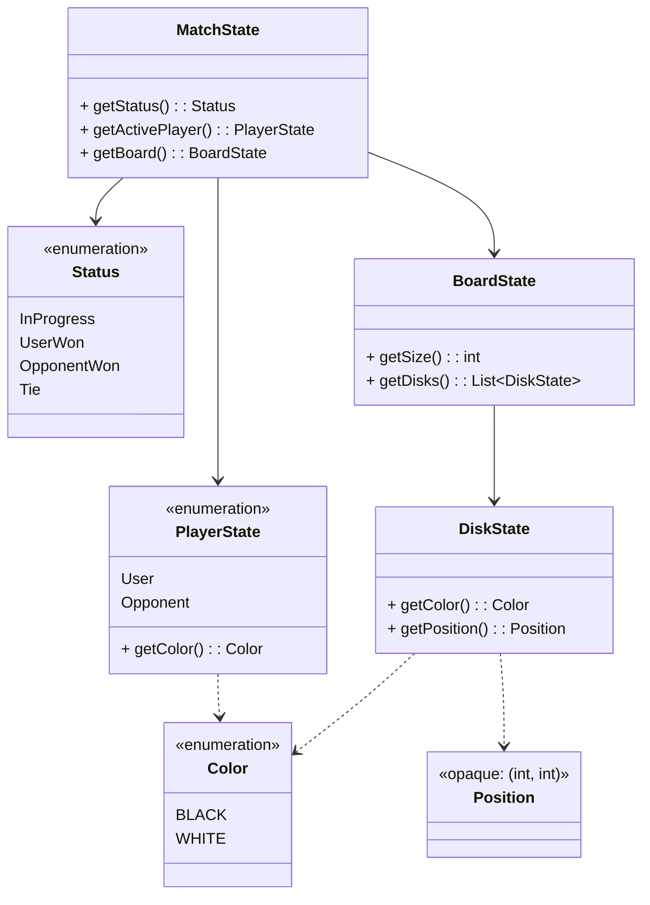

---

### Gestione dell'aggiornamento della View a seguito di cambiamenti nel Model, secondo il pattern Observer

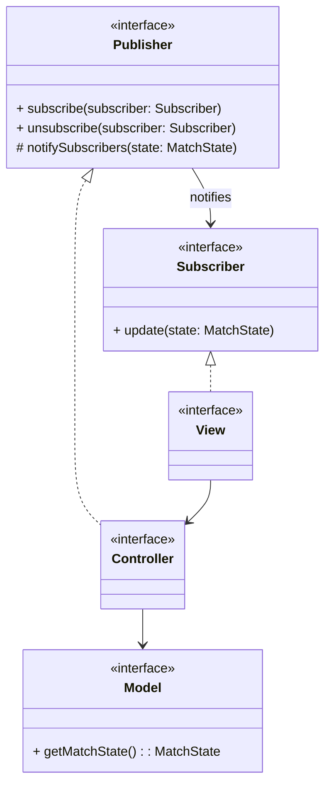

---

### BoardManager

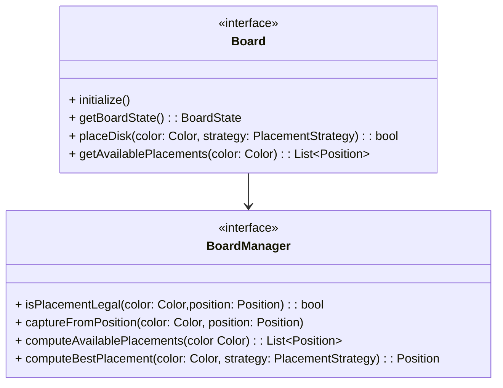

---

### Player

La struttura del componente Player è stata progettata come un'interfaccia, che rappresenta un giocatore generico, che può fare scelte di posizionamento dei dischi sulla scacchiera.

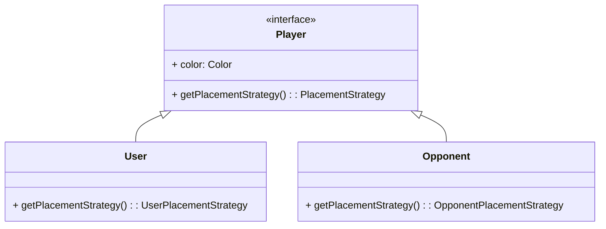

### PlacementStrategy

La placement strategy è una interfaccia che permette di definire il comportamento del giocatore, sia esso umano o virtuale.

In particolare, la placement strategy definisce un metodo `computePlacement(match: MatchState): Position`, che prende in input lo stato attuale della partita e restituisce la posizione in cui il giocatore vuole posizionare il disco.

Per il giocatore umano, la placement strategy consiste semplicemente nel leggere l'input dell'utente e restituire la posizione selezionata.

Mentre per l'avversario virtuale, la placement strategy consiste nel calcolare la mossa da eseguire in base a uno stile di gioco predefinito, come ad esempio massimizzare il numero di pedine catturate o minimizzare il numero di pedine catturate dall'avversario.

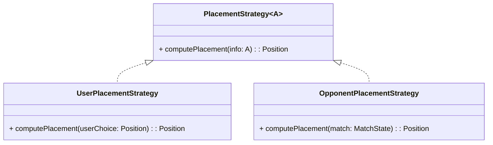

---

### SaveManager

Il save manager è un componente del controller che si occupa di gestire il salvataggio e il caricamento dello stato della partita.

Il save manager fornisce due metodi principali:

- `save(matchState: MatchState)`: salva lo stato della partita corrente su un file.
- `load()`: carica lo stato della partita da un file.

Solo una istanza del save manager è presente all'interno del controller.\
Questa istanza può salvare un unico stato della partita alla volta, e il salvataggio sovrascrive eventuali salvataggio precedente.

Il caricamento tenta di leggere lo stato della partita da un file, e se il file non esiste o è corrotto, il save manager riporta un errore al controller.

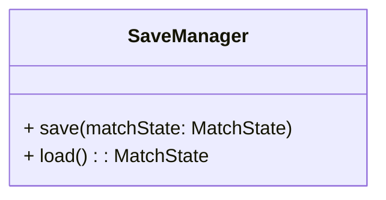

#### Scenario: salvataggio di una partita

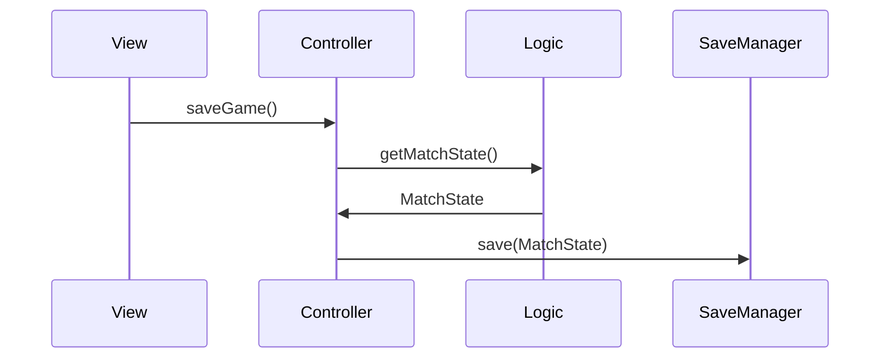

#### Scenario: caricamento di una partita

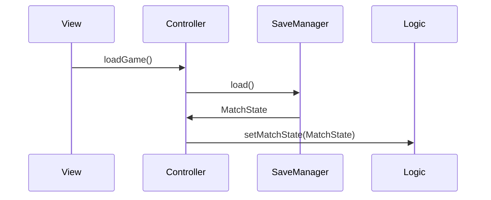

---

### Disk

`Disk` è un componente del Model che modella le pedine (o dischi) del gioco. 

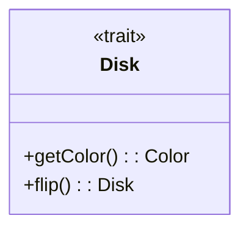

Nello specifico:

- `getColor()` restituisce il suo colore;
- `flip()` capovolge il disco (cambiandone il colore).

### Board

`Board` è un componente del Model che modella la scacchiera su cui si svolge la partita. 

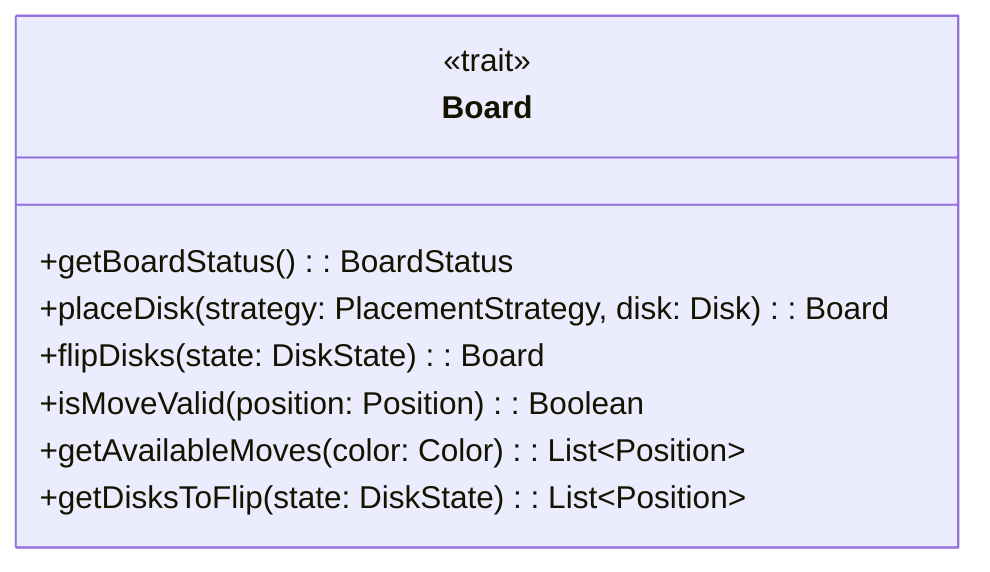

In particolare:

- `getBoardStatus()` permette di ottenere lo stato attuale della scacchiera;
- `placeDisk()` inserisce un nuovo disco sulla scacchiera, restituendo una nuova scacchiera con le informazioni aggiornate;
- `flipDisks()` si occupa di capovolgere i dischi catturati dal nuovo disco piazzato sulla scacchiera, restituendo una scacchiera nuova con i valori aggiornati;
- `isMoveValid()` controlla se la mossa selezionata è valida in base alle regole del gioco;
- `getAvailableMoves()` calcola tutte le posizioni delle possibili mosse valide, restituendone una lista;
- `getDisksToFlip()` funzione che resistuisce una lista che contiene le posizioni dei dischi da capovolgere in base al nuovo disco piazzato.

### MatchController

`MatchController` è un componente del controller che si occupa del coordinamento della partita.

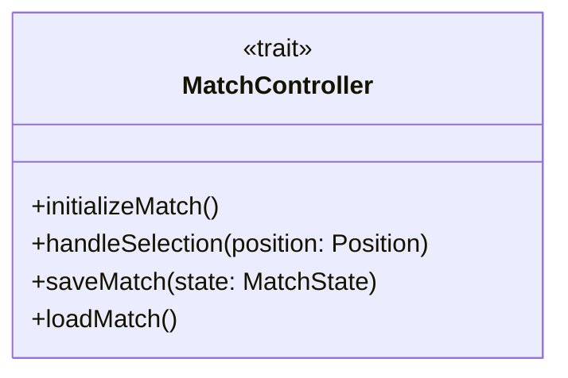

In dettaglio:

- `initializeMatch()` inizializza la partita con la configurazione iniziale della scacchiera stabilita dalle regole del gioco;
- `handleSelection()` si occupa di gestire la posizione in cui l'utente vuole posizionare un nuovo disco;
- `saveMatch()` salva lo stato della partita attuale;
- `loadMatch()` carica il salvataggio di una partita.
