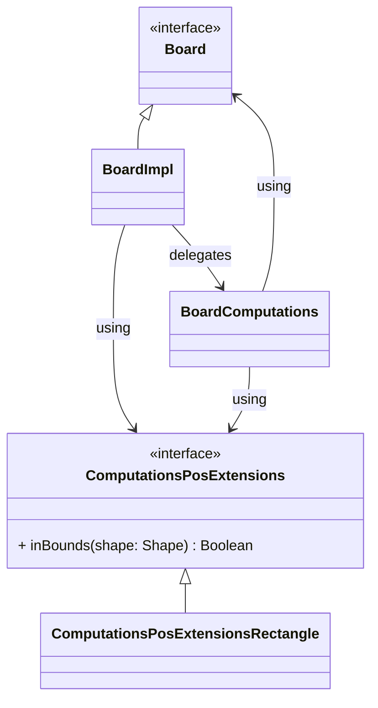

# Implementazione - Cristina Zoccola

## Lavoro svolto

All'interno del progetto mi sono occupata di implementare:

- le pedine di gioco: [`Disk`](#disk);
- la scacchiera di gioco, comprese le computazioni necessarie allo svolgimento di una partita su di essa: [`Board`](#board) (e il suo [`companion object`](#board-companion-object)), [`BoardImpl`](#boardimpl), [`BoardCreationExtensions`](#boardcreationextensions), [`BoardComputations`](#boardcomputations), [`ComputationsPosExtensions`](#computationsposextensions) e [`ComputationsPosExtensionsRectangle`](#computationsposextensionsrectangle);
- alcuni *extension methods* di `Int` per aggevolare i calcoli da effettuare sulla `Board`: [`IntExtensions`](#intextensions);
- il controller dell'applicazione, [`Controller`](#controller) (e il suo [`companion object`](#controller-companion-object)) e [`ControllerImpl`](#controllerimpl);
- i [metodi nella classe `Position`](#metodi-in-position).

## Aspetti implementativi rilevanti

### Disk

**Disk** è una `case class` che modella le pedine di gioco, come descritto nella sua sezione di [design di dettaglio](../4-detailed-design.md).

### Board



**Board** è un `trait` che modella la scacchiera su cui viene svolta una partita, come definito nella sua sezione di [design di dettaglio](../4-detailed-design.md#board-e-disk).

Questo `trait` è implementato dalla classe: `BoardImpl`.

#### BoardImpl

**BoardImpl** è una `class` che implementa il `trait` descritto sopra:

- la forma e i dischi sono i parametri della stessa;
- i metodi restanti sono implementati al suo interno.

Le computazioni, richieste per implementare i diversi metodi, sono tutte delegate (**delegation pattern**, descritto nel [design di dettaglio](../4-detailed-design.md#board-e-disk)) alla classe `BoardComputations`.

Essa utilizza un contesto di tipo `ComputationsPosExtensions`, tramite un `given/using`, per effettuare i calcoli sulla forma della `Board` corretta, il `given` è definito in una *factory* prima di istanziare la classe.

All'interno della classe viene anche definito un `given` della stessa, da dare come contesto alla classe `BoardComputations` per permetterle di operare sull'istanza della `Board` corrente.

L'unico modo per istanziare la classe è tramite i *factory method* contenuti nel `companion object` di `Board` attraverso i metodi `apply()`.

#### Board companion object

Il `companion object` del `trait` `Board`, contiene le *factory* (**factory pattern**) per istanziare la classe `BoardImpl`.

Contiene *factory* a partire da:

- una forma, usata per istanziare una `BoardImpl` con la configurazione iniziale delle pedine;
- lo stato di una `Board`, per ottenere una `BoardImpl` con quello stato, utile a ricreare la `Board` dopo il caricamento di un salvataggio;
- la forma e le pedine, per creare una `BoardImpl` che abbia quella forma e quelle pedine su di essa.

Per togliere verbosità, la prima *factory* citata, utilizza un metodo per ottenere una mappa di pedine a partire da una stringa, il metodo citato è contenuto nell'oggetto: `BoardCreationExtensions`.

Nell'ultima *factory* descritta, viene creato il `given` di tipo `ComputationsPosExtensions` utilizzando il *pattern matching* sulla forma della scacchiera:

```scala
def apply(shape: Shape, disks: Map[Position, Disk]): Board =
  given ComputationsPosExtensions = shape match
    case _ => ComputationsPosExtensionsRectangle()
  BoardImpl(shape, disks)
```

Ho fatto questa scelta per rendere il codice estendibile semplicamente aggiungendo codice nuovo e non modificando quello esistente: una volta aggiunta una nuova forma (`Shape`) tutto quello che resta da fare è:

- creare un nuovo `object` che implementi `ComputationsPosExtensions`;
- aggiungere un `case` al `match case` mostrato sopra.

#### BoardCreationExtensions

**BoardCreationExtension** è un *singleton* `object`.

Al suo interno è contenuto un `extension method` di `String`:

```scala
extension (s: String)
  def toPosDiskMap: Map[Position, Disk] =
    val pattern = 
      """(\((?<position>\d+,\s*\d+)\)\s*->\s*(?<color>[A-Za-z]))""".r
    pattern.findAllMatchIn(s).map(w =>
      val position: Position = w.group("position")
      val disk = w.group("color").toLowerCase match
        case "w" => Disk(Color.White)
        case "b" => Disk(Color.Black)
      position -> disk
    ).toMap
```

Questo metodo utilizza lo specifico *pattern* definito come espressione regolare, per creare una mappa di pedine a partire da una stringa. Esso è stato implementato in collaborazione con [Emanuele Borghini](./emanuele-borghini.md).

Fa anche uso della `implicit conversion` di `Position` da tupla a posizione (implementata da: [Emanuele Borghini](./emanuele-borghini.md)).

Uso del metodo nella *factory*:

```scala
val initialDisks: Map[Position, Disk] =
      s"""
        ${bottomRightCenterPos.left.up} -> W
        ${bottomRightCenterPos.up} -> B
        ${bottomRightCenterPos.left} -> B
        $bottomRightCenterPos -> W
      """.toPosDiskMap
```

#### BoardComputations

**BoardComputations** è una `class` che utilizza due contesti tramite `given/using`: uno di tipo `Board` e l'altro di tipo `ComputationsPosExtensions`, entrambi approfonditi nei paragrafi precedenti.

Questa classe è il delegato della classe `BoardImpl`.

Per implementare i metodi delegati da `BoardImpl` ho utilizzato diverse funzionalità di Scala:

- `given/using` nei metodi che hanno bisogno di un contesto diverso in base a che momento dell'esecuzione vengono invocati;

  ```scala
  given disks: Map[Position, Disk] = board.disks
  // oppure
  given newDisks: Map[Position, Disk] = 
    board.disks + (diskPos -> Disk(diskColor))
  ```

- `for comprehension` con `guard`;
  
  esempio nel metodo `getAvailablePlacements(Color)`:

  ```scala
  for
    (disk, neighbour) <- capturableDisks
    direction: Position = disk - neighbour
    availableMove: Option[Position] = 
      _getNextEmptyPosition(neighbour, direction)
    if availableMove.isDefined
  yield availableMove.get
  ```

- `pattern matching`;
- `tail recursion` con `pattern matching`.

  esempio:

  ```scala
  @tailrec
  def _getNextEmptyPosition(diskPos: Position, direction: Position): 
  Option[Position] = 
    val neighbourPos:Position = diskPos - direction
      neighbourPos match
        case p
          if (!p.inBounds(board.shape)) ||
            (board.disks.contains(p) && 
            board.disks(p).color.equals(diskColor)) =>
            Option.empty
        case p if board.disks.contains(p) => 
          _getNextEmptyPosition(p, direction)
        case p => Some(p)
  ```

Alcune parti del *refactor* effettuato su questa classe, sono state fatte in collaborazione con: [Emanuele Borghini](./emanuele-borghini.md).

#### ComputationsPosExtensions

**ComputationsPosExtensions** è un `trait` che contiene un `extension method` di `Position`, questo metodo definisce i confini della scacchiera.

#### ComputationsPosExtensionsRectangle

**ComputationsPosExtensionsRectangle** è un *singleton* `object` che implementa il `trait` `ComputationsPosExtensions`.

In questo `object` viene implementato il metodo definito nel `trait`: con i confini da rispettare in caso di scacchiera quadrata o rettangolare.

### IntExtensions

**IntExtensions** è un *singleton* `object` di *utility*, che contiene `extension methods` di `Int`, utili per operare con le coordinate delle posizioni.

### Controller

**Controller** è un `trait` che descrive il *controller* dell'applicativo, si occupa di gestire la partita (turni e aggiornamenti) e dei salvataggi:

- gestisce la notifica degli aggiornamenti estendendo il `trait` `Publisher`;
- gestisce i salvataggi interfacciandosi con il `SaveManager`.

Esso è implementato come descritto nella sua sezione contenuta nel [design di dettaglio](../4-detailed-design.md#controller):

Questo `trait` è implementato dalla classe `ControllerImpl`.

#### ControllerImpl

**ControllerImpl** è una `class` in cui ho implementato in autonomia la gestione dell'inizio della partita e dei turni dei giocatori, tramite i seguenti metodi: `startMatch(Shape, Color, OpponentType)`, `handleSelection(Position)` e `handleOpponentTurn()`.

Per quanto riguarda gli altri metodi presenti al suo interno:

- i seguenti metodi: `subscribe(Subscriber[MatchState])`, `unsubscribe(Subscriber[MatchState])`, `notifySubscribers(MatchState)` e `isMatchOver()` sono stati implemetati in collaborazione con [Elena Boschetti](./elena-boschetti.md);
- I metodi creati per interfacciarsi con il `SaveManager` (`saveMatch(String)`, `loadMatch(String)`, `saveFileNames` e `deleteSaveFile(String)`) sono stati implementati in collaborazione con [Emanuele Borghini](./emanuele-borghini.md) e [Elena Boschetti](./elena-boschetti.md).

In questa classe ho utilizzato le seguenti funzionalità di Scala:

- `pattern matching` per distinguere i seguenti casi:

  - turno dell'utente o turno dell'avversario;
  - partita correttamente iniziata oppure no.

- `tail recursion` per gestire i possibili turni multipli dell'avversario.

  ```scala
  @tailrec
  private def handleOpponentTurn(): Unit =
    notifySubscribers(logic.get.state)
    logic.get.state.activePlayer match
      case ActivePlayer.Opponent if !isMatchOver =>
        logic = Some(logic.get.placeOpponentDisk())
        handleOpponentTurn()
      case _ => ()
  ```

Il *refactor* del metodo appena citato è stato fatto in collaborazione con [Elena Boschetti](./elena-boschetti.md). 

Dopo ogni cambiamento del `MatchState`, il controller notifica del cambiamento tutti i *subscribers* tramite la funzione `notifySubscribers(MatchState)`.

L'unico modo per istanziare la classe è tramite il *factory method* contenuto nel `companion object` di `Controller` attraverso il metodo `apply()`.

#### Controller companion object

All'interno del `companion object` del `trait` `Controller`, è presente una *factory* (**factory pattern**) per istanziare la classe `ControllerImpl`.

### Metodi in Position

Ho implementato tutti i metodi presenti all'interno della `case class` `Position`.

Per implementare i metodi ho usato le seguenti funzionalità di Scala:

- `pattern matching`;
- creazione di un **accumulatore** tramite `tail recursion` e `pattern matching`.

```scala
@tailrec
def _getPosOnSameDiagonal(source: Position, destination: Position,
          direction: Position, acc: Set[Position] = Set()): Set[Position] =
  val nextPos: Position = source - direction
  (nextPos, destination) match
    case (f, s) if f.equals(s) => acc
    case (f, s) => _getPosOnSameDiagonal(f, s, direction, acc + f)
```

Nei pezzi di codice mostrati nelle sezioni precedenti, è possibile vedere l'uso di alcuni dei metodi implementati.

I metodi che permettono di "muoversi" lungo gli assi, ottenendo la posizione nella direzione richiesta, oltre ad essere usati nel codice di produzione, sono anche usati per rendere i test più semplici e leggibili.

[Indice](./index.md)
